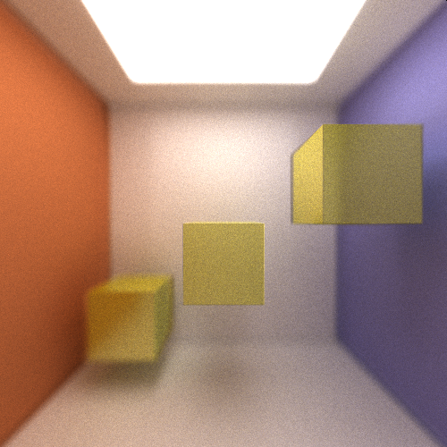

CUDA Path Tracer
================

**University of Pennsylvania, CIS 565: GPU Programming and Architecture, Project 3**

Terry Sun; Arch Linux, Intel i5-4670, GTX 750

A CUDA-accelerated path tracer.

## Features

### Materials

The pathtracer supports the following material surfaces:

* diffuse: light scatters uniformly from the surface
* specular/reflective (perfect and imperfect): light reflects perfectly off the
  surface; or, light takes an imperfect reflected directly using the [Phong
  BRDF][gpu-specular].
* refractive (using [Schlick's Approximation][wiki-schlick] to blend reflective
  and refractive light bounces): glass, water

  [gpu-specular]: http://http.developer.nvidia.com/GPUGems3/gpugems3_ch20.html
  [wiki-schlick]: https://en.wikipedia.org/wiki/Schlick%27s_approximation

### Depth of Field

Depth of field simulates a physical aperture by varying the origin and direction
of rays shot from the camera. DOF is defined with a focal distance from the
camera, at which objects are perfectly in focus, and an aperture radius,
defining the amount of variance added to each ray.





### Antialiasing

Camera rays are shot from the camera's position in the direction of a pixel.
Antialiasing jitters the target of the ray within a pixel.

### Stream compaction.

Shared-memory work-efficient stream compaction.

### Texture mapping

### Bump mapping

## Run

To build: `make`

To run: `build/cis565_path_tracer SCENE_FILE.txt`.

Some sample scene files are found in `scenes/`.

### Controls

* Esc to save an image and exit.
* Space to save an image. Watch the console for the output filename.
* W/A/S/D and R/F move the camera. Arrow keys rotate.

### Scene File Format

This project uses a custom scene description format. Scene files are flat text
files that describe all geometry, materials, lights, cameras, and render
settings inside of the scene. Items in the format are delimited by empty lines,
and comments can be added using C-style `// comments`.

The camera is defined in the following fashion:

```
CAMERA //camera header
RES        (float x) (float y) //resolution
FOVY       (float fovy)        //vertical field of view half-angle.
ITERATIONS (float interations) //how many iterations to render the image before saving
DEPTH      (int depth)         //maximum depth (number of times the path will bounce)
FILE       (string filename)   //file to output render to upon completion
EYE        (float x) (float y) (float z) //camera's position in worldspace
VIEW       (float x) (float y) (float z) //camera's view direction
UP         (float x) (float y) (float z) //camera's up vector
DOF        (float focal dist) (float aperture radius)
```

Textures are defined in the following fashion:

```
TEXTURE (image name)
```

Materials are defined in the following fashion:

```
MATERIAL  (material ID)                 //material header
RGB       (float r) (float g) (float b) //diffuse color
SPECX     (float specx)                 //specular exponent
SPECRGB   (float r) (float g) (float b) //specular color
REFR      (bool refr)       //refractivity flag, 0 for no, 1 for yes
REFRIOR   (float ior)       //index of refraction for Fresnel effects
EMITTANCE (float emittance) //the emittance of the material; >0 is a light source
TEXTURE   (int textureid)   //texture corresponding to diffuse coloring
NORMAL    (int textureid)   //texture corresponding to a normal map
```

Objects are defined in the following fashion:

```
OBJECT (object ID)     //object header
(cube OR sphere)
material (material ID) //material to assign this object
TRANS (float x) (float y) (float z) //translation
ROTAT (float x) (float y) (float z) //rotation
SCALE (float x) (float y) (float z) //scale
```
