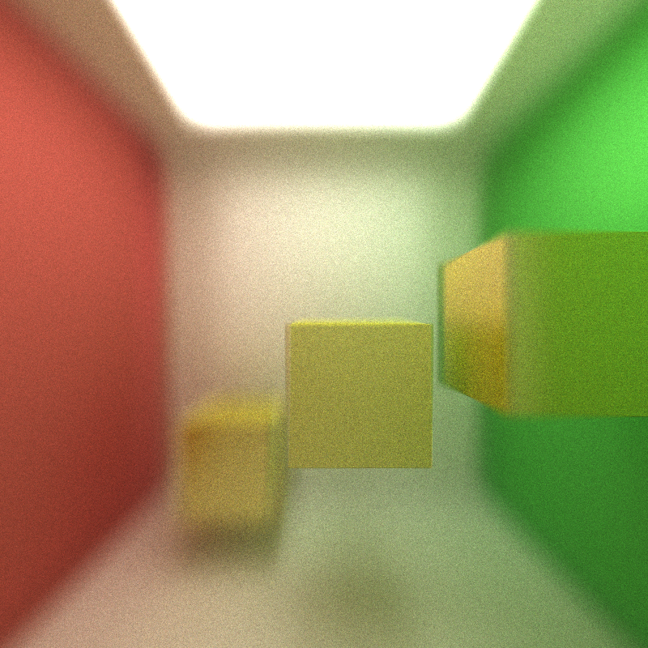
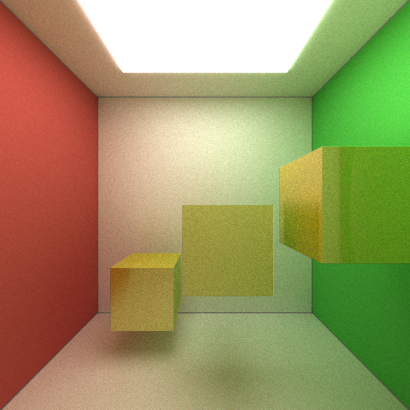

CUDA Path Tracer
================

**University of Pennsylvania, CIS 565: GPU Programming and Architecture, Project 3**

Terry Sun; Arch Linux, Intel i5-4670, GTX 750

This project is a CUDA-accelerated path tracer. Many cool features, such as:

Some sample scenes are found in `scenes/`.

## Running the code

To build: `make` 

To run: `build/cis565_path_tracer SCENE_FILE.txt`.
Some sample scene files are found in `scenes/`.

### Controls

* Esc to save an image and exit.
* Space to save an image. Watch the console for the output filename.
* W/A/S/D and R/F move the camera. Arrow keys rotate.

### Depth of Field





### Antialiasing
### Materials

Diffuse, specular (perfectly and imperfectly reflective), refractive materials.

### Stream compaction.

Shared-memory work-efficient stream compaction.


* Texture mapping
* Bump mapping
* Direct lighting (by taking a final ray directly to a random point on an
  emissive object acting as a light source)
* Some method of defining object motion, and motion blur
* Subsurface scattering
* Arbitrary mesh loading and rendering (e.g. `obj` files). You can find these
  online or export them from your favorite 3D modeling application.
  With approval, you may use a third-party OBJ loading code to bring the data
  into C++.
  * You can use the triangle intersection function `glm::intersectRayTriangle`.

This 'extra features' list is not comprehensive. If you have a particular idea
you would like to implement (e.g. acceleration structures, etc.), please
contact us first.

For each extra feature, you must provide the following analysis:

* Overview write-up of the feature
* Performance impact of the feature
* If you did something to accelerate the feature, what did you do and why?
* Compare your GPU version of the feature to a HYPOTHETICAL CPU version
  (you don't have to implement it!) Does it benefit or suffer from being
  implemented on the GPU?
* How might this feature be optimized beyond your current implementation?

### Scene File Format

This project uses a custom scene description format. Scene files are flat text
files that describe all geometry, materials, lights, cameras, and render
settings inside of the scene. Items in the format are delimited by new lines,
and comments can be added using C-style `// comments`.

Materials are defined in the following fashion:

```
MATERIAL (material ID) //material header
RGB (float r) (float g) (float b) //diffuse color
SPECX (float specx) //specular exponent
SPECRGB (float r) (float g) (float b) //specular color
REFL (bool refl) //reflectivity flag, 0 for no, 1 for yes
REFR (bool refr) //refractivity flag, 0 for no, 1 for yes
REFRIOR (float ior) //index of refraction for Fresnel effects
EMITTANCE (float emittance) //the emittance of the material; >0 is a light source
```

The camera is defined in the following fashion:

```
CAMERA //camera header
RES (float x) (float y) //resolution
FOVY (float fovy) //vertical field of view half-angle.
ITERATIONS (float interations) //how many iterations to refine the image,
only relevant for supersampled antialiasing, depth of field, area lights, and
other distributed raytracing applications
DEPTH (int depth) //maximum depth (number of times the path will bounce)
FILE (string filename) //file to output render to upon completion
EYE (float x) (float y) (float z) //camera's position in worldspace
VIEW (float x) (float y) (float z) //camera's view direction
UP (float x) (float y) (float z) //camera's up vector
```

Objects are defined in the following fashion:

```
OBJECT (object ID) //object header
(cube OR sphere OR mesh) //type of object, can be either "cube", "sphere", or
"mesh". Note that cubes and spheres are unit sized and centered at the
origin.
material (material ID) //material to assign this object
TRANS (float x) (float y) (float z) //translation
ROTAT (float x) (float y) (float z) //rotation
SCALE (float x) (float y) (float z) //scale
texture (FILE) // optional: image file for texture mapping.
```
