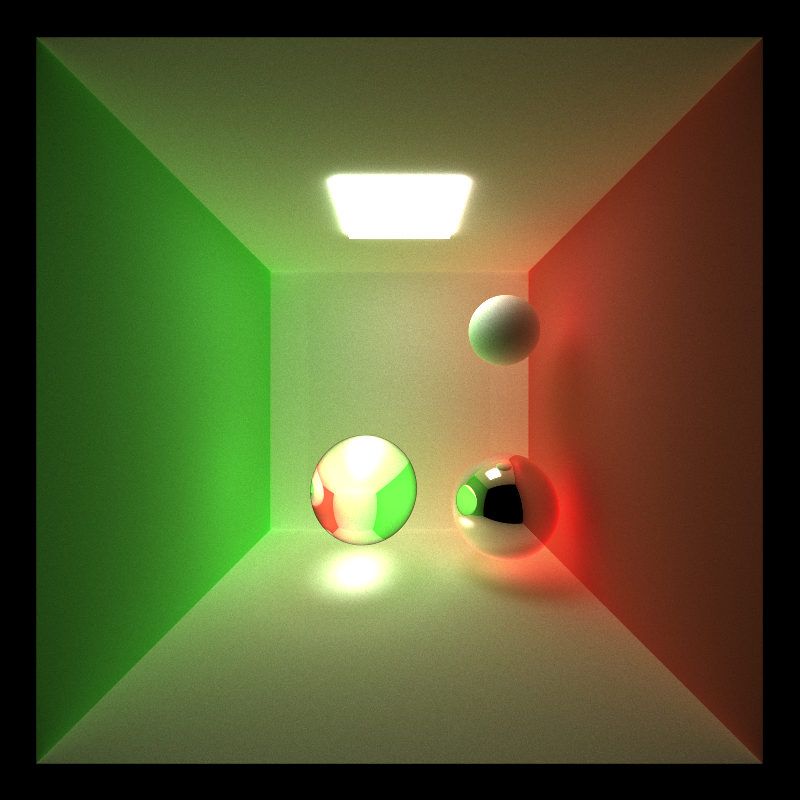
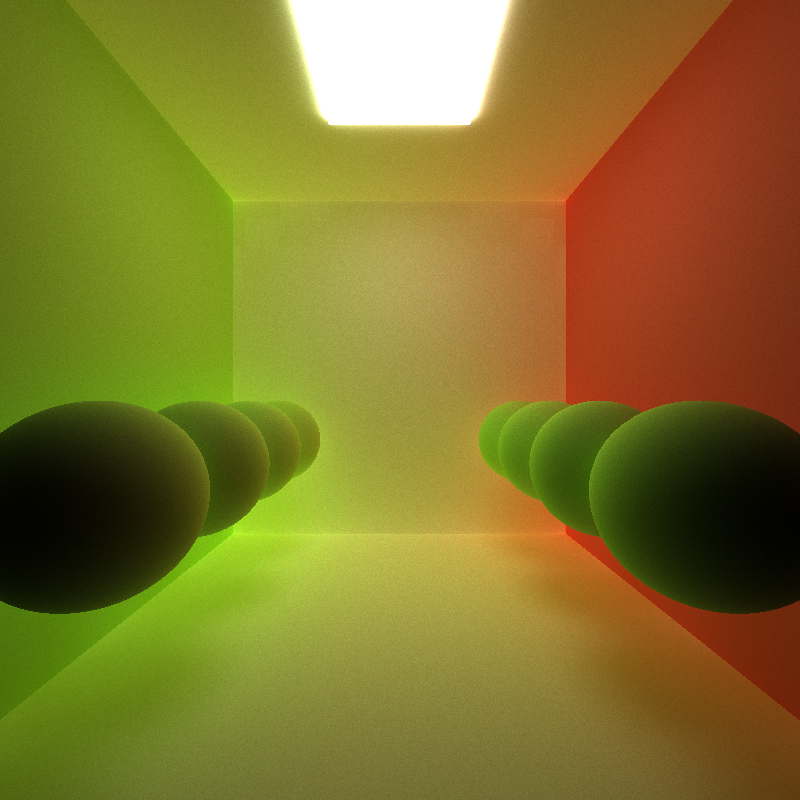
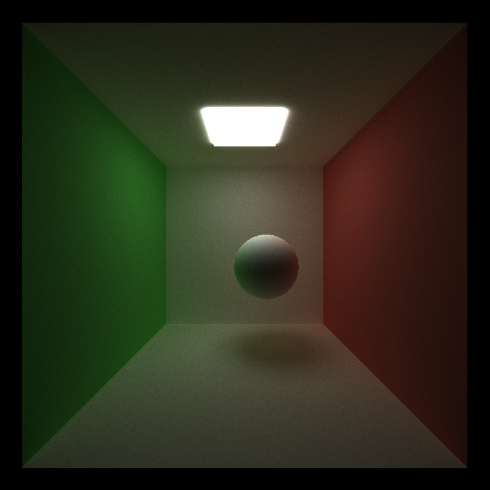

CUDA Path Tracer
================

**University of Pennsylvania, CIS 565: GPU Programming and Architecture, Project 3**

* Xinyue Zhu
* Tested on: ( Windows 10, i5-5200U @ 2.20GHz 8GB, GTX 960M
window 10 can be really buggy in this project..crushed my computer again and again.

========================

## README

1.refraction & perfect reflection &diffuse color &direct light from ceiling light
|
2.without depth of field 
|   
3.with depth of field
|
4.without direct light
|
