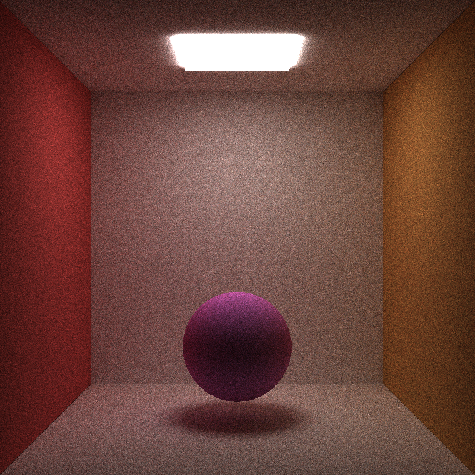
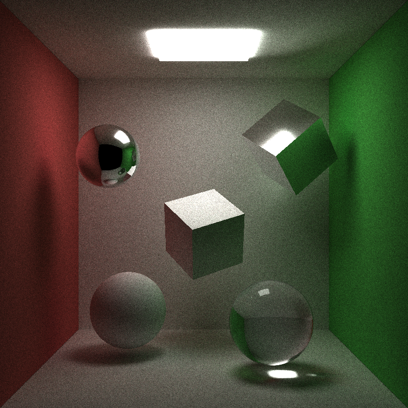
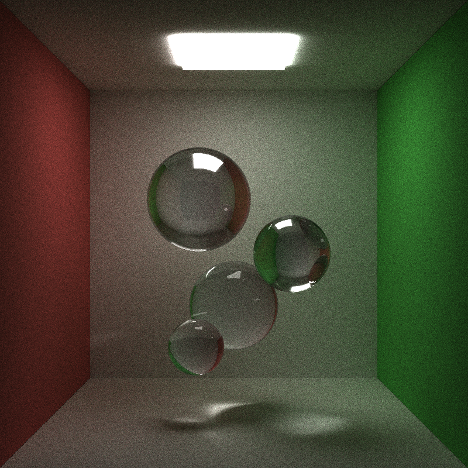
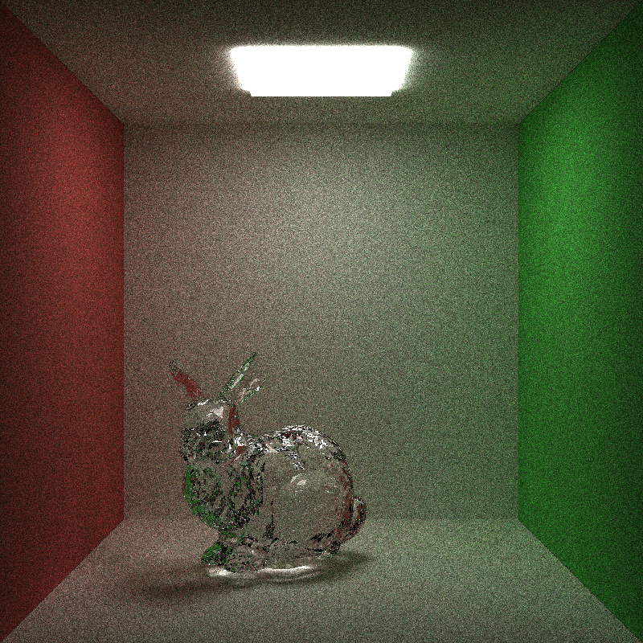
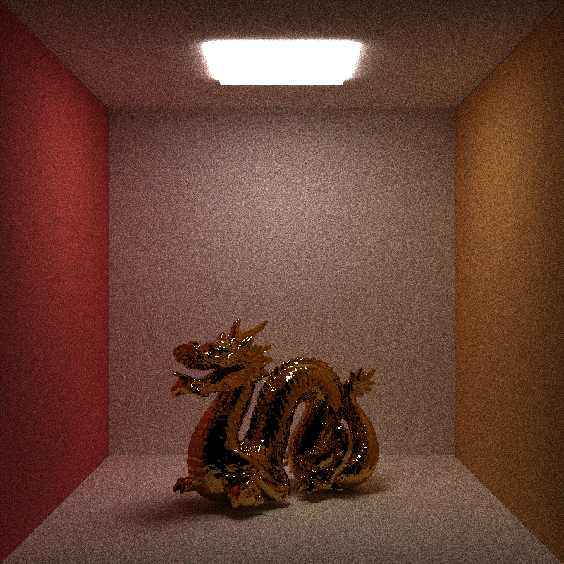
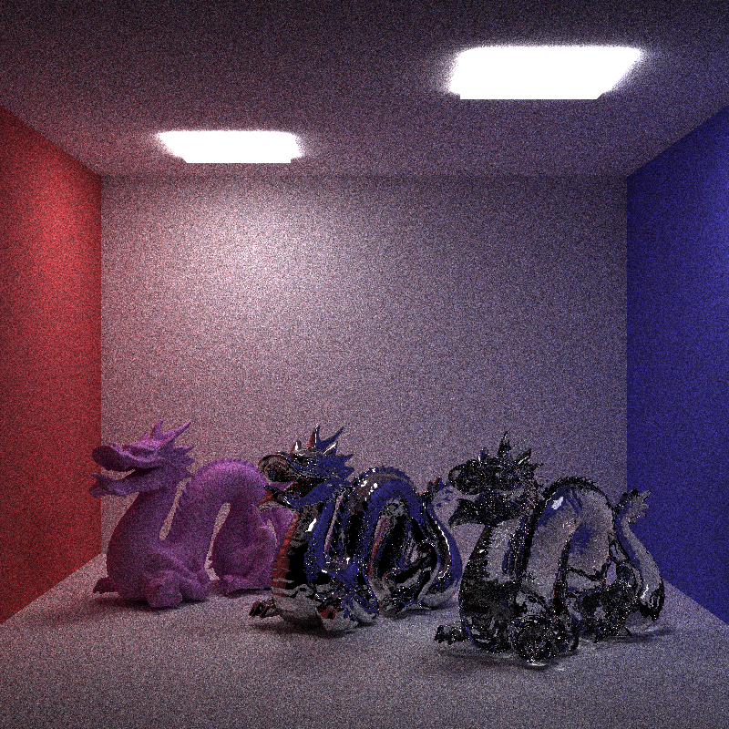

CUDA Path Tracer
================

**University of Pennsylvania, CIS 565: GPU Programming and Architecture, Project 3**

siqi Huang Tested on: Windows 7, Inter(R) Core(TM) i7-4870 HQ CPU@ 2.5GHz; GeForce GT 750M(GK107) (Personal Computer)

PART I: Camera Setup
The camera is the first part of the project, when projecting into the scene, we use the color'r rgb value to represent its normal direction, and we get the sample image like this . This means we have the correct camera setup

PART II: Basic Path Tracing
We begin with the diffuse surface intersection. When we hit the light or hit nothing, the ray terminate. Or the color acculumate along the path, the bounce of ray is based on the hemisphere cosine ray function. After this is done, we get image like this . We can see from the image that image that the back wall have fuse color on the two side because of the color of the side walls.

PART III: Perfect Specular Object
The perfect specular object follow the mirror reflection rule If we hit a perfect specular object, we accumate its color and directly rebounce the ray. 

PART IV: Transparent Object
Using Snell's law we can get the refraction ray. However, in the actual situation, some ray in fact bounce like the perfect specular ray. To simulate this, we use Fresenl's law and in practice we use schlick's approach for simulation. One thing to draw here is that we can not use recursive method to follow all ray, so whether a ray actually rebounce or refract depends on the random number generator. If the num of iteration is larget, the overall effect is correct

PART V: Mesh Intersection
We first read obj file into our program and copy them to GPU. Here we intersect the ray with each triangle of the object. The copy to GPU may become a problem. In general, first copy all vertex,normal,index of the mesh, then copy the mesh itself. That can guarantee you get the whole structure of the mesh and they are all linked to each other on GPU. 

PART VI:  Kdtree Acceleration
The above mesh intersection is the naive method, which is OK for small objects, but impossible for larget objects. So we use a kdtree to accelerate the computation. We first create the kdtree on CPU recursively, then copy the structure onto GPU. This process is much more complex than copy a mesh. The copy here is recursively, using a postorder traverse of the tree to help. First copy the left and right child of the tree, pass its data to GPU, link the pointer to the CPU pointer, then copy the whole tree to GPU. The recursive funciton should return the GPU pointer. When all this is done, the acutal simplifaction of intersection is done on GPU. Because we do not know beforehand how much triangle will a ray intersect, I can only hard code the number used for the actual triangle intersection. If we do that on CPU, we can use vector to store the information which means we do not need to deal with the space issue, but on GPU it is different. Kdtree On GPU has many SIGGRAPH paper to reference, to improve this part, a lot of work is needed.

PART VII:

