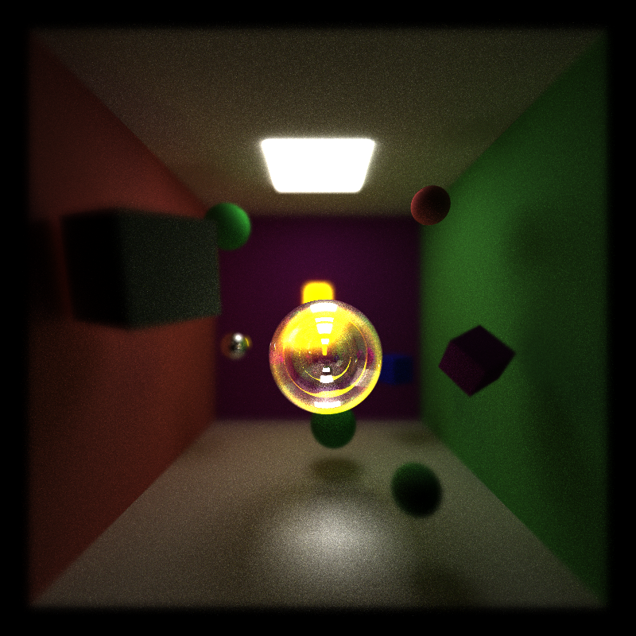
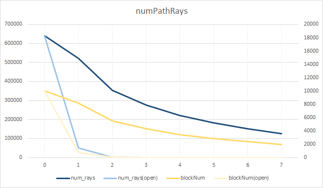
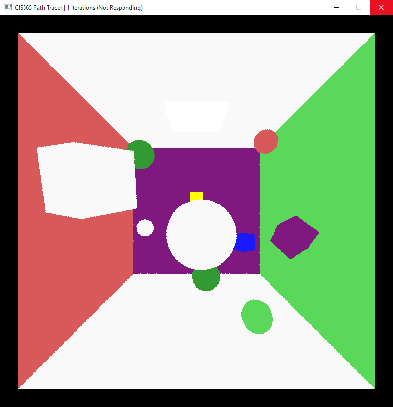
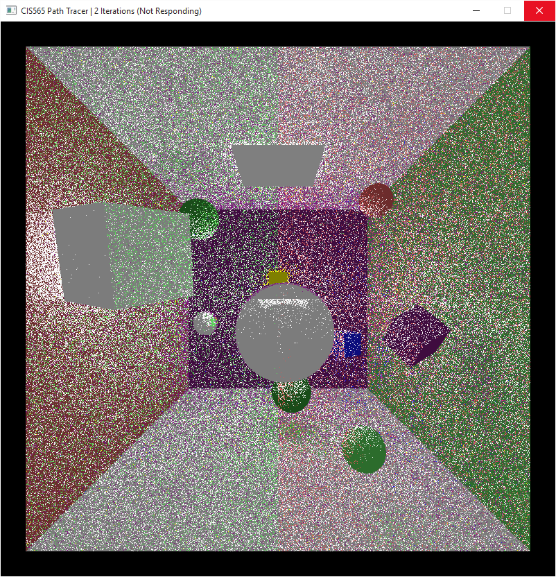
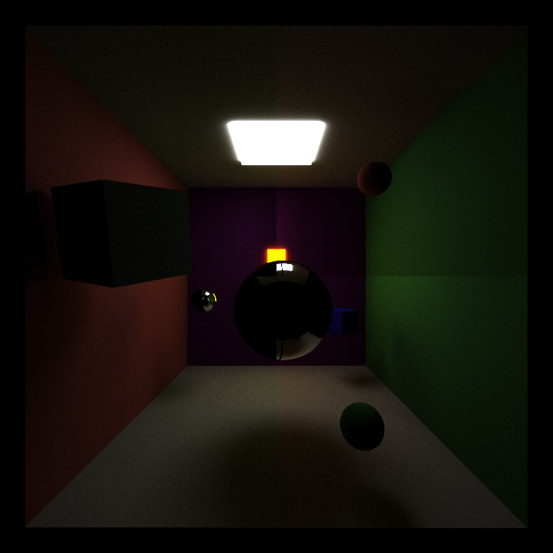

CUDA Path Tracer
================

**University of Pennsylvania, CIS 565: GPU Programming and Architecture, Project 3**

* Shuai Shao (Shrek)
* Tested on: Windows 10, i7-4710HQ @ 2.50GHz 16GB, GeForce GTX 970M (Personal Computer)

-----------------------------------------

## Image Example
* Simple scene shows diffuse, reflection, refraction, caustic, global illumination, antialiasing, and soft shadow

* Lens effect

* Obj File

-----------------------------------

## Features

### General Intro

GPU accelerated Monte Carlo path tracer launches parallel threads to calculate ray intersections and shading. Instead of using recursive ray tracing functions, the GPU approach maintains a ray array, and do stream compaction to exclude terminated rays for each bounce in an iterative way. Paths ray bounces through the scene and terminates by either hitting the light source or hitting nothing. The final image averages the pixel value results of tons of iterations to get a well rendered image. Since the algorithm is embarrassingly  parallel, the GPU approach can be must faster than the CPU counterpart. 

### Anti aliasing

It is easy to implement Anti-aliasing in GPU Path Tracer. Simply jittering the ray within a pixel can lead to an averaged pixel value. 

### Lens effect

Reference: PBRT 6.2.3

Traditional path/ray tracer basically is modeled as a pinhole camera. For real camera, because of the focal length of the lens, only the objects in a range of distance to the image plane can be projected on the reasonable same pixel and form a clear image. Objects out of that the range will project on an area instead of a point on the image plane which means a blurred image.  Larger aperture leads to a shorter range of well focused length, i.e. a bluer image.

To model this feature, we need two more varaibles for the camera. Lens radius and focalLength. Objects on the focalPlane will be projected on the same point on the image plane. Given a ray whose origin is at the middle of the lens(the origin of the camera), by finding the focus point on the focalPlane, we can compute the ray that goes through the focus point and a random point on the lens. So that we get a new ray whose origin is randomly distributed on the lens but goes through the focus point on the focal plane as its original pin hole ray does. The direction of the new ray is slightly different from the original one, thus objects that are far from the focal plane will be blurred. 

### Work-efficient stream compaction with shared memory and multi blocks

Reference: GPU Gems 3 ch 39

Shared memory has a much faster access speed compared to global memory. Since work-efficient stream compaction has a tree structure, it needs lots of memory accessing, using shared memory can greatly increase the performance. Because shared memory is shared within a block and the size is limited, we need to cooperate through multi blocks. What we do is a multi level scan. We do exclusive scan on each block. then we collect the sum of each block and do a exclusive scan, add them back to their block. 

The stream compaction can considerably decrease the number of active path rays, reduce the number of blocks. The influence is more obvious in a open scene

Sloving Bank conflict: use a macro to solve the same bank accessing (currently not using)

### Refraction with Frensel effect

Reference: PBRT 

Update the Scatter Ray Function to scatter refraction ray at specific time. 

### Obj file loading and rendering

Read vertex, vertex normal, face, etc info from obj file.
Code is partly adapted from my previous Ray Tracer Project in UC Berkley CS 184.

### Stackless kd-tree for GPU (still buggy)

reference: KD-Tree Acceleration Structures for a GPU Raytracer, Tim Foley and Jeremy Sugerman, Stanford University, Graphics Hardware (2005)

The biggest difference of kd-tree on GPU from that of CPU is that we can't use recursive function or use full stack on GPU.

I implement kd-backtrack algorithm. Which use backtrack to play the role of popping node from stack. Unfortuntely, this part is still buggy. Now the code can work correct in terms of low level backtrack. I use a depth hit test program to debug. It can be seen in this simple scene, the first depth hit is correct due to low level kd-tree. Yet there are rays losing intersection after the first hit test. So the result is darker. When it comes to complex tree like a obj file, current code will lose a lot of intersections. Although I spend the most time implementing and debugging this part, I fail to debug it completely before due time. Really a pity........ TODO in future.

(left: naive parse, right: current kd tree)

* hit depth = 0
   

* hit depth = 1
   

* kd tree wrong
 

----------------------

## TIPS 

* When doing CUDA debugging, if some threads trap to infinite loops, the debug can fail. To get rid of this, it is better to set a limitation for number of loops for every loop in the kernel. Together with printing the error info. This way can make the debugging much easier and less confusing about the CUDA error like grid launch error. 

* I met racing conditions with large blockSize work-efficient stream compaction. I haven't got time to handle this. Currently just use blockSize of 32 to get rid of this. Larger blockSize can result in tiny patterns in the image.

* \__constant__ memory can be used for geoms, kd nodes, and material to increase accessing speed since they are constant once constructed by CPU code. This can be done in future. 

