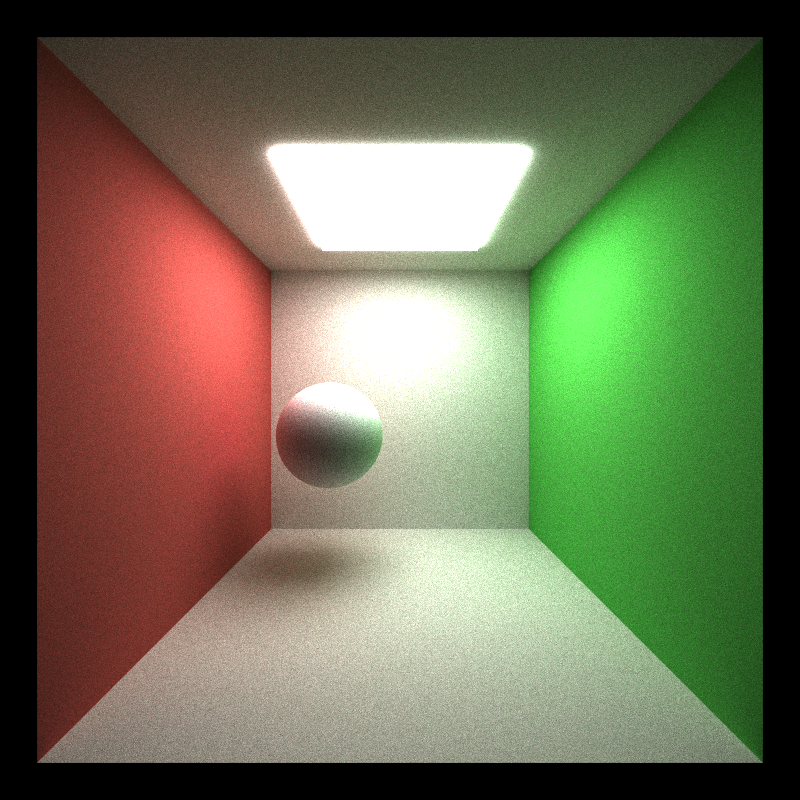

CUDA Path Tracer
================

**University of Pennsylvania, CIS 565: GPU Programming and Architecture, Project 3**

* Sally Kong
* Tested on: Windows 8, i7-5500U CPU @ 2.40GHz 2.40 GHz, GEForce 920M (Personal)

**Summary:**
A CUDA-based path tracer capable of rendering
globally-illuminated images very quickly.

### Contents

* `src/` C++/CUDA source files.
* `scenes/` Example scene description files.
* `img/` Renders of example scene description files.
  (These probably won't match precisely with yours.)
* `external/` Includes and static libraries for 3rd party libraries.

### Running the code

The main function requires a scene description file. Call the program with
one as an argument: `cis565_path_tracer scenes/sphere.txt`.
(In Visual Studio, `../scenes/sphere.txt`.)

If you are using Visual Studio, you can set this in the Debugging > Command
Arguments section in the Project properties. Make sure you get the path right -
read the console for errors.

#### Controls

* Esc to save an image and exit.
* Space to save an image. Watch the console for the output filename.
* W/A/S/D and R/F move the camera. Arrow keys rotate.

