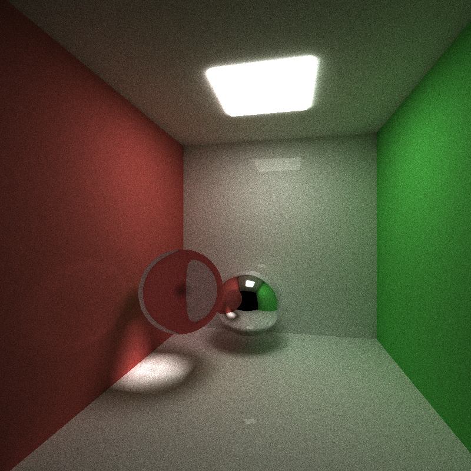
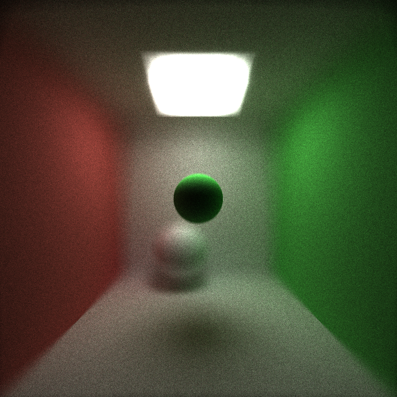

CUDA Path Tracer
================

**University of Pennsylvania, CIS 565: GPU Programming and Architecture, Project 3**

* Levi Cai
* Tested on: Windows 8, i7 @ 2.22GHz 22GB, GTX 222 222MB
* 

This is a path tracer implemented in CUDA that supports basic ray casting, diffuse and specular surfaces, sphere and cube intersections, work efficient-stream compaction with shared memory, motion blurring, refraction, and depth-of-field.

### Examples of Features Implemented

## Specular vs. Diffuse Surfaces

## Motion Blurring

## Refraction (Glass)

## Depth of Field

### Analysis

* Stream compaction helps most after a few bounces. Print and plot the
  effects of stream compaction within a single iteration (i.e. the number of
  unterminated rays after each bounce) and evaluate the benefits you get from
  stream compaction.
* Compare scenes which are open (like the given cornell box) and closed
  (i.e. no light can escape the scene). Again, compare the performance effects
  of stream compaction! Remember, stream compaction only affects rays which
  terminate, so what might you expect?

## Submit

If you have modified any of the `CMakeLists.txt` files at all (aside from the
list of `SOURCE_FILES`), you must test that your project can build in Moore
100B/C. Beware of any build issues discussed on the Google Group.

1. Open a GitHub pull request so that we can see that you have finished.
   The title should be "Submission: YOUR NAME".
2. Send an email to the TA (gmail: kainino1+cis565@) with:
   * **Subject**: in the form of `[CIS565] Project N: PENNKEY`.
   * Direct link to your pull request on GitHub.
   * Estimate the amount of time you spent on the project.
   * If there were any outstanding problems, or if you did any extra
     work, *briefly* explain.
   * Feedback on the project itself, if any.
