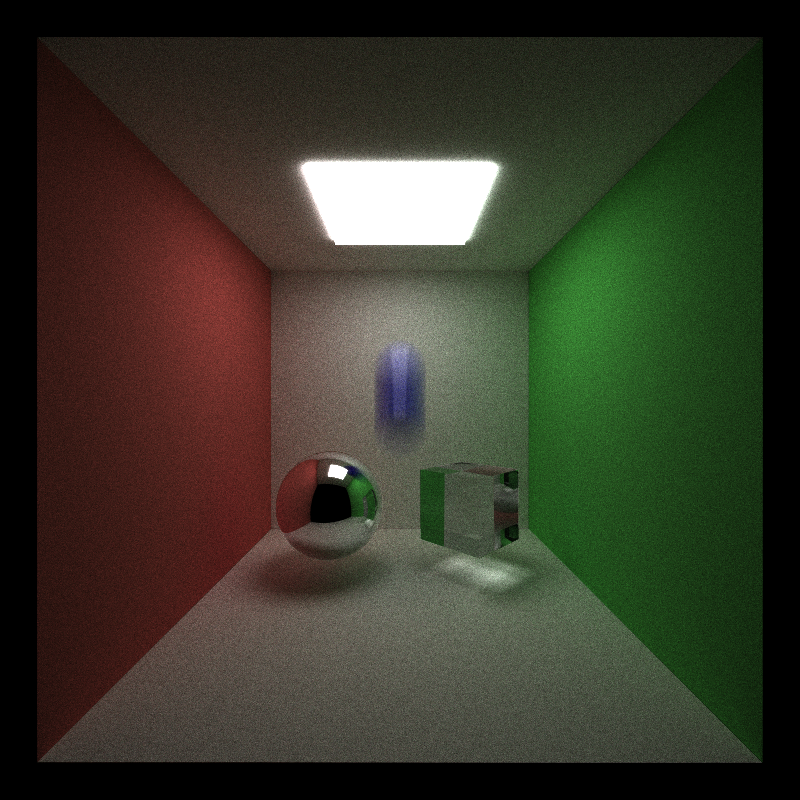
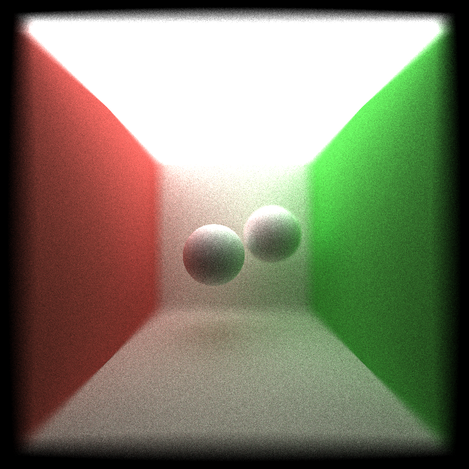
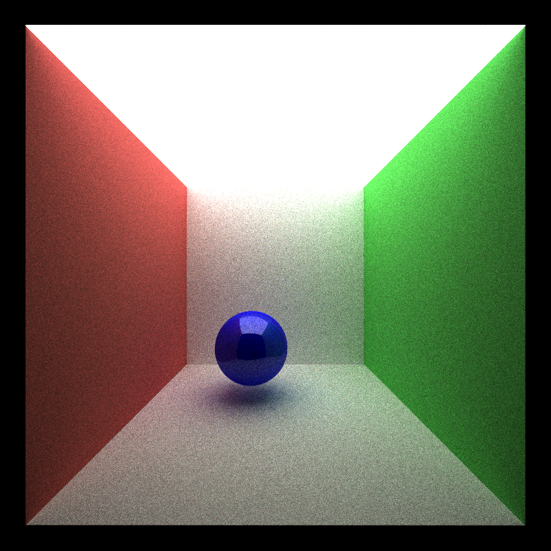
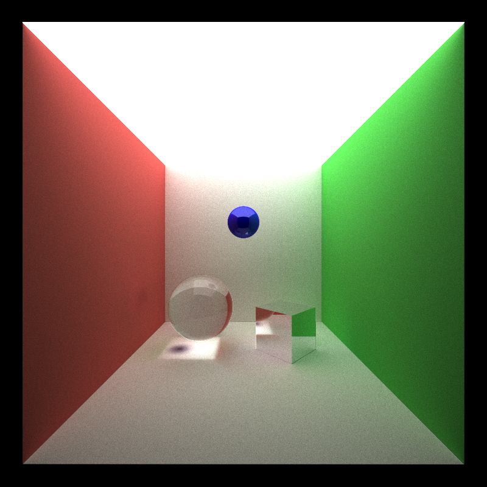
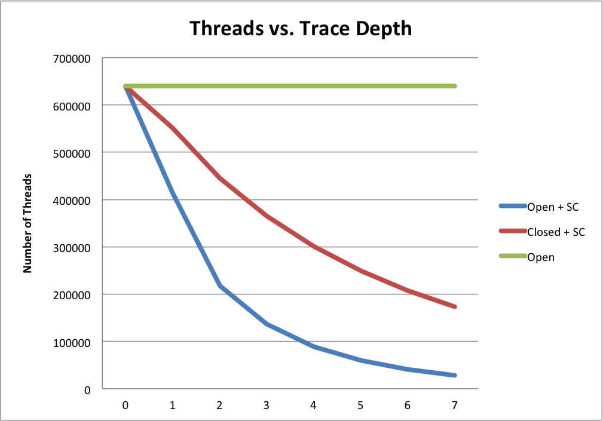
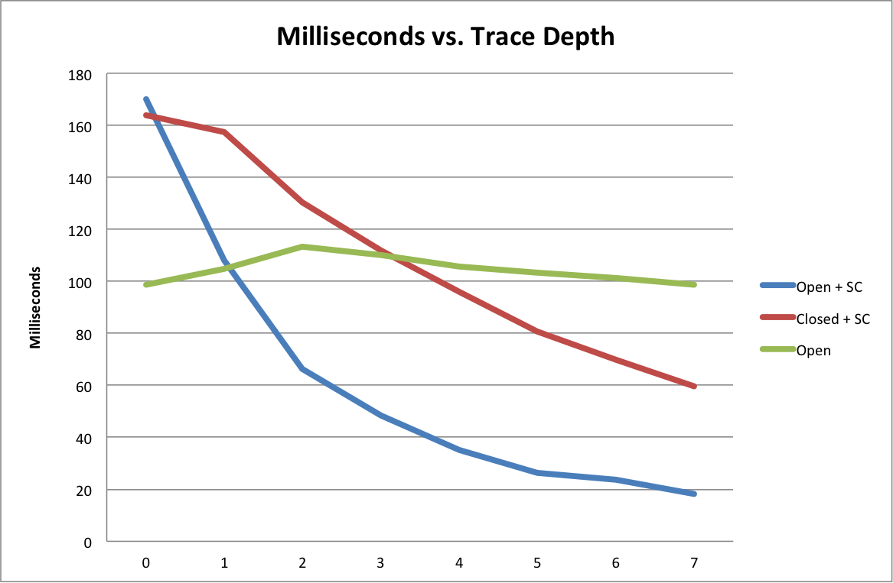

CUDA Path Tracer
================

**University of Pennsylvania, CIS 565: GPU Programming and Architecture, Project 3**

* Megan Moore
* Tested on: Windows 7, i7-4770 @ 3.40GHz 16GB (Moore 100 Lab C)

* This is the final image of my GPU Path Tracing project.  It shows a combination of different surfaces, motion blur, and antialiasing.  

* Antialiasing: Antialiasing was done by jittering each ray as it was shot to a pixel.  A random variable was created, and the ray was offset by that amount.  This occured in every iteration on the GPU.  As this occurred while each ray was being generated on the GPU, it did not cause any time to be added to the overall run time of the path tracer.  The same would be true if it had been done on a CPU, as it is such a small amount of work.  However, if I were to have done pixel sampling, which would have added the amount of rays that are shot for each pixel, this would have greatly increased the time, whether on a CPU or GPU.  It would have caused less of a slow down on the GPU, however. It would have increased the amount of threads needed, but would still be faster than creating an even larger for loop on the CPU.  

* Depth of field: This was implemented by jittering the location of the aperatus, as the rays were being shot through it.  Given a specific distance, we can choose which objects that are in focus and which are not.  This was helpful to do on the GPU, because each ray could easily be jittered on the GPU.  Again, like antialiasing, this did not cause any slow down on the overall run time.  Doing this on the CPU would also not cause any slow down.  It is a small calculation to change the original direction of the ray being shot at a pixel, so it does not require much memory or time. 

.png "Refraction with an IOR of glass")

* This final image shows the refracting surfaces, specular surfaces, difuse, and mirros.  

### Analysis

* Stream compaction helps most after a few bounces. Print and plot the
  effects of stream compaction within a single iteration (i.e. the number of
  unterminated rays after each bounce) and evaluate the benefits you get from
  stream compaction.
  
  
  * As you can see from the above graphs, as the number of threads decreases, the amount of time spend in each path trace decreases.  The green line shows when there is no stream compaction.  It is clear why the time stays fairly consistant, becuase there is no change in the number of threads being used on the GPU.  It starts off taking less time than the stream compaction because of the memory transfers that the stream compaction must do.  However, in the end, the stream compaction saves enough time, by lowering the number of threads used in each path trace, that the overall time to run is lower when stream compaction is used.  It is also clear from these graphs, that stream compaction allows for more of a speer-up in an open room.  This is talked about more in the below paragraph.  
* Compare scenes which are open (like the given cornell box) and closed
  (i.e. no light can escape the scene). Again, compare the performance effects
  of stream compaction! Remember, stream compaction only affects rays which
  terminate, so what might you expect?

  * Because rays terminate when they hit a light, or do not intersect with anything, in a closed room, there will not be any rays that do not intersect anything.  Thus, less rays will be terminated.  It is because of this that the stream compaction will not be used as much as compared to an open room.  We would guess that stream compaction does not help speed up the running time in a closed room as much as it does in an open one.  Test results helped to prove this answer.  The average time that one iteration took in an open room with no stream compaction was 578.326 milliseconds.  The average time for an open room with stream compaction was 467.913.  This means that the average speed-up time that stream compaction gave in an open room was 110.413 milliseconds per iteration.  Now we can compare this to the average time in a closed room.  The average time for a closed room with no stream compaction was 757.264 milliseconds per iteration.  For a closed room with stream compaction it was 664.501 milliseconds per iteration.  This means that the average speed-up time for a closed room was only 92.763 milliseconds per iteration.  This shows how stream compaction is more helpful in a open room compared to a closed room.  

