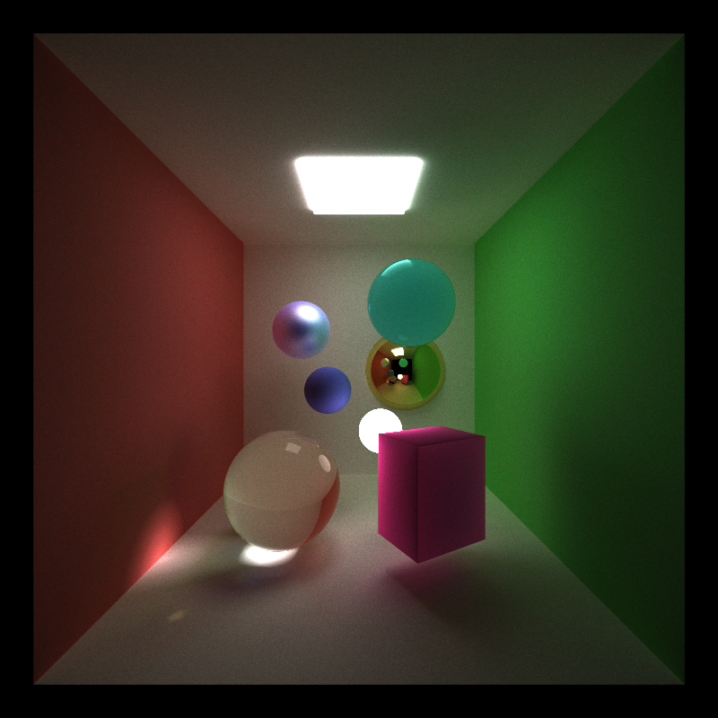
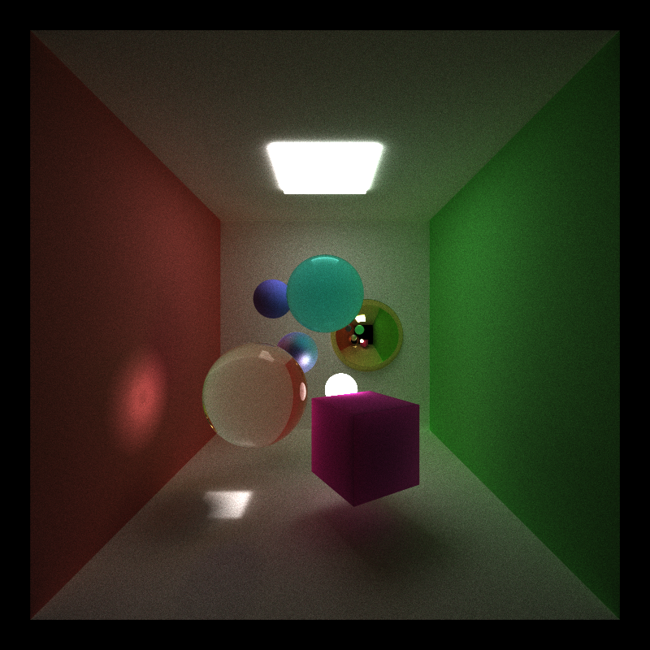
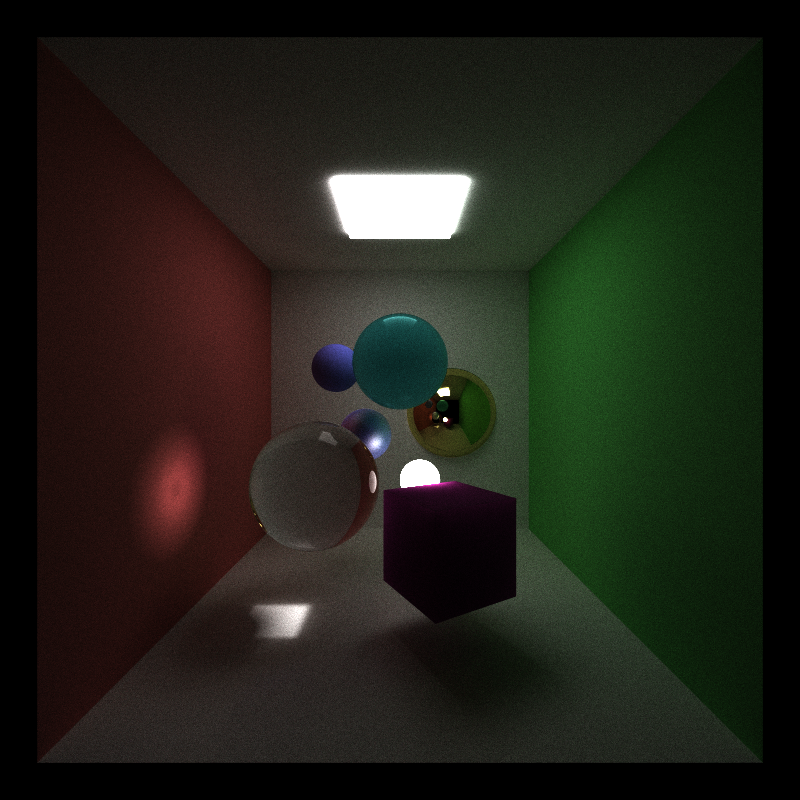

CUDA Path Tracer
================

**University of Pennsylvania, CIS 565: GPU Programming and Architecture, Project 3**

* Ziwei Zong
* Tested on: Windows 10, i7-5500 @ 2.40GHz 8GB, GTX 950M (Personal)

Description
========================

## Overview
This GPU based path tracer with global illumination and anti-alising can render diffuse, perfect/non-perfect specular, transparent and subsurface scattering materials. Shown as the picture below.

## Features

#### Materials
	*diffuse
	*Perfect Specular Materials (Mirrors)
	*specular
	*Subsurface Scattering

	*transparent (w fresnel)

#### Global Illumination

With Direct Lighting	|  Without Direct Lighting
:----------------------:|:-------------------------:
		|		

#### Work-efficient Stream Compaction with Shared Memory

## Analysis
   #### stream compaction
        (shared mem work-eff/thrust::remove_if/no stream compact)
   #### Open vs Closed scenes

## Appendix
   #### command line
   #### control
   #### scene file
   #### future work
   #### base code
   #### references
