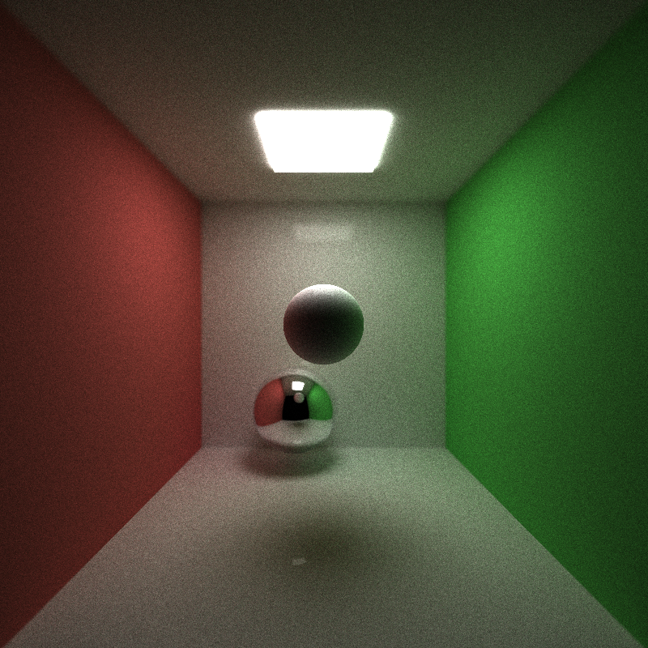
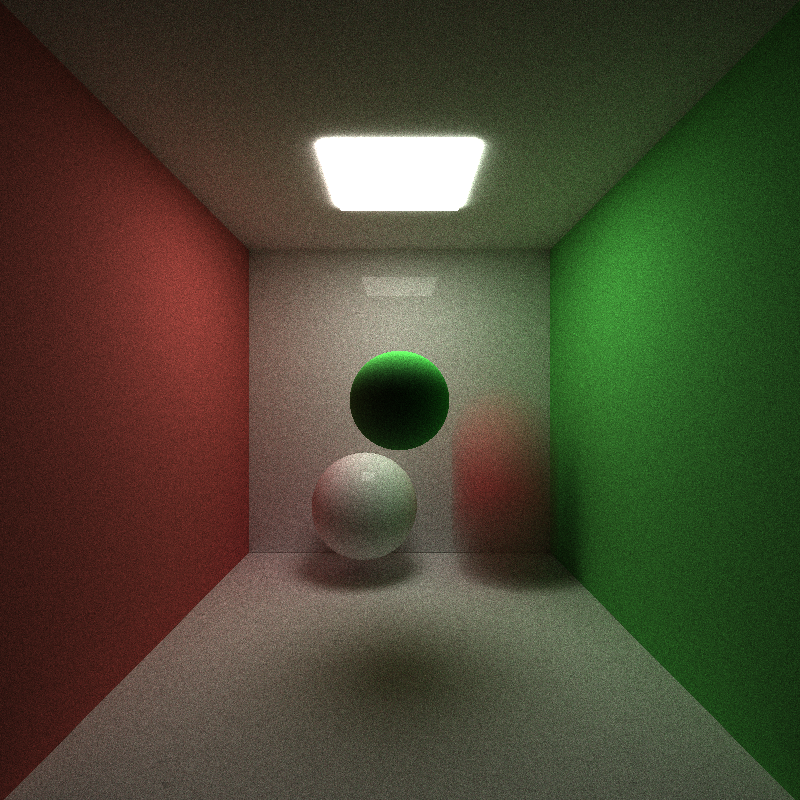
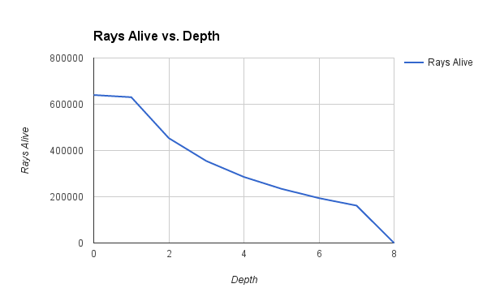
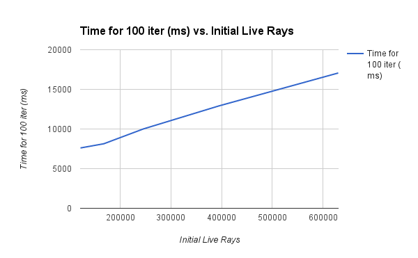

CUDA Path Tracer
================

**University of Pennsylvania, CIS 565: GPU Programming and Architecture, Project 3**

* Levi Cai
* Tested on: Windows 8, i7-5500U @ 2.4GHz 12GB RAM, NVIDIA GeForce GTX 940M 2GB

This is a path tracer implemented in CUDA that supports basic ray casting, diffuse and specular surfaces, sphere and cube intersections, work efficient-stream compaction with shared memory, motion blurring, refraction, and depth-of-field.

### Examples of Features Implemented

## Specular vs. Diffuse Surfaces

Here I demonstrate the difference in specular vs. diffuse surfaces. The colors are simply determined by intensities associated with the materials, the direction that the rays are then scattered are determined by the contribution of specular color vs. diffuse color of the object probabilistically. If the a particular ray is determined to be specular, we simply compute the surface normal of the reflection and the new ray direction is v = v - 2 * dot(v,n) * n. If it is diffuse, then we compute the new direction according to a randomly sampled hemisphere around the surface normal with cosine weighting.

## Motion Blurring

Motion blurring is achieved by specifying a start and goal position for objects in the scene that are moving. Then before each iteration of path tracing, we randomly and uniformly adjust the position of the object along that vector, then proceed the iteration as before. This allows us to get a fairly nice motion blur that still works regardless of the number of iterations requested. An alternative is to attempt to move the object iteration by iteration (and not randomly), but it is difficult to tell how much it should move each iteration because they do not necessarily correspond to reasonable time intervals.

## Refraction (Glass)

Refraction is created by using Schlick's approximation in order to determine the amount of rays that are specular reflections and the rest are refractive. Refractions are then computed according to glm::refract.

## Depth of Field

The depth of field feature is accomplished by taking the initial rays that are projected from the origin, finding their intersection to a plane located at the focal length away from the camera, and then finding new ray directions by adjusting the camera origin randomly each iteration according to the aperture size.

### Analysis of Work-Efficient Shared Memory Stream Compaction

I implemented the work-efficient stream compaction with shared memory scan function as described by http://http.developer.nvidia.com/GPUGems3/gpugems3_ch39.html

This allows for significant performance gains in OPEN environments where rays are quickly terminated (or in environments with an extreme number of lights). We can see some of the effects in the graphs below:

(Above) I compared the depth in the original cornell image with the number of still-living rays. There is a logarithmic drop-off in the scene of number of still living rays that must be tracked, but for the first several depths the gains are quite dramatic as rays leave the open side of the box quickly.

(Above) Here we wish to see the effect of very open environments vs. the runtime. To see this, I simply moved the camera's starting position back in the original Cornell image setup (so many rays immediately terminate) and we can see that the performance increases linearly with the number of rays that immediately terminate. We can thus imagine a completely enclosed scene to gain nothing from stream compaction (if anything, it hurts a small amount to do the extra computation due to the cudaMallocs and such, though many of those could possibly be avoided).

