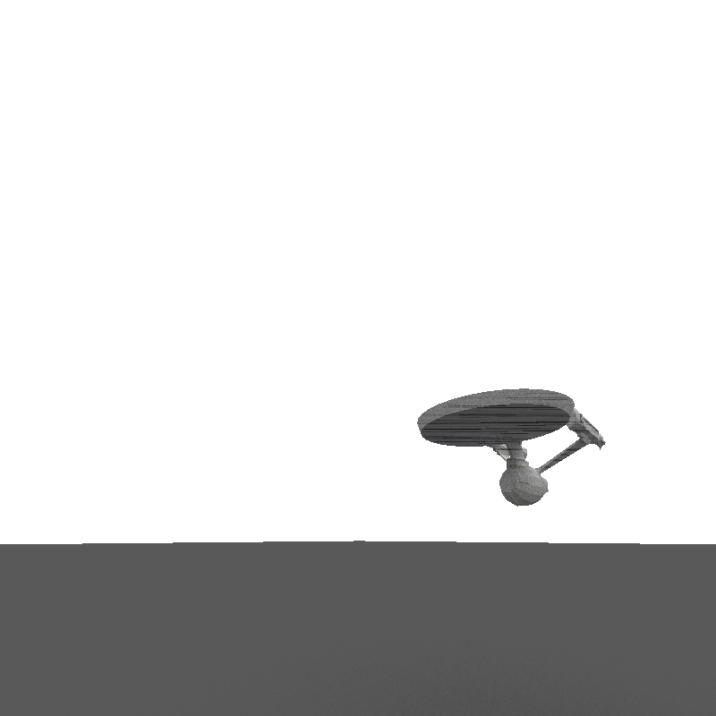
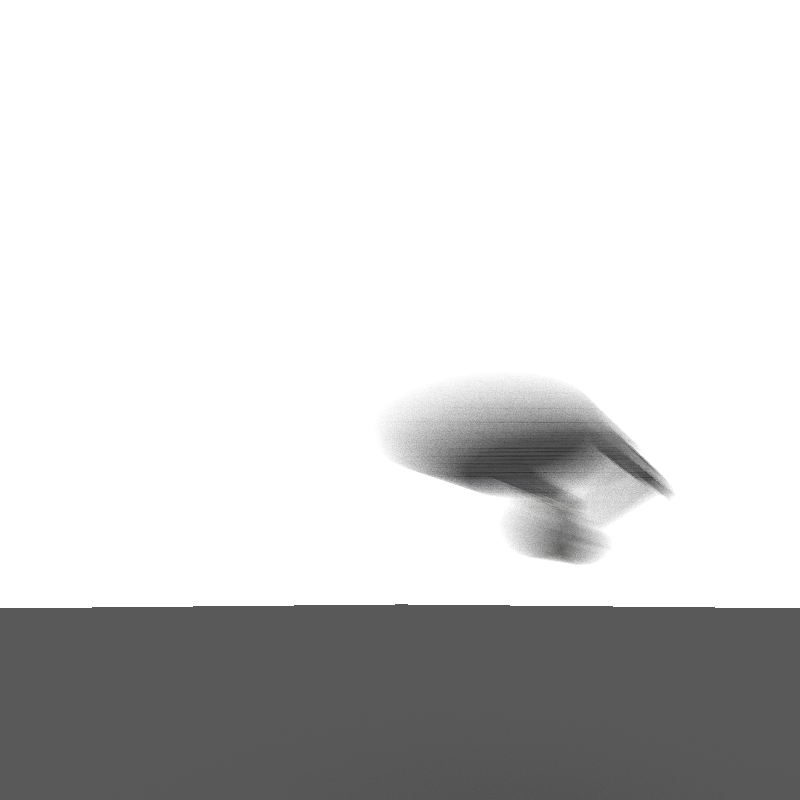

CUDA Path Tracer
================

**University of Pennsylvania, CIS 565: GPU Programming and Architecture, Project 3**

* Kangning Li
* Tested on: Windows 10, i7-4790 @ 3.60GHz 16GB, GTX 970 4096 MB (Personal)

  