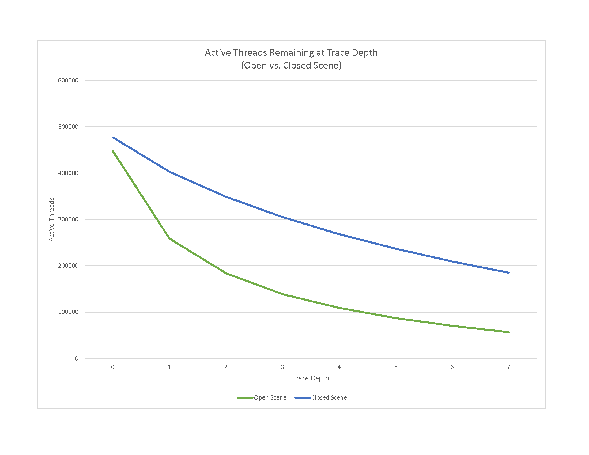
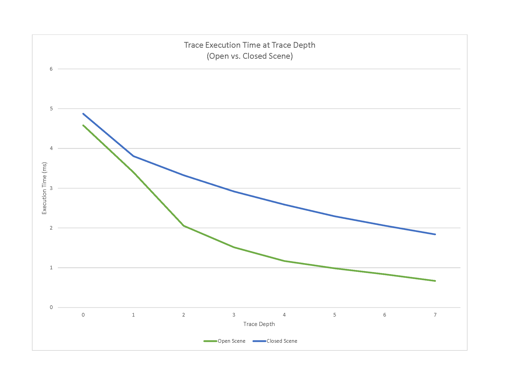
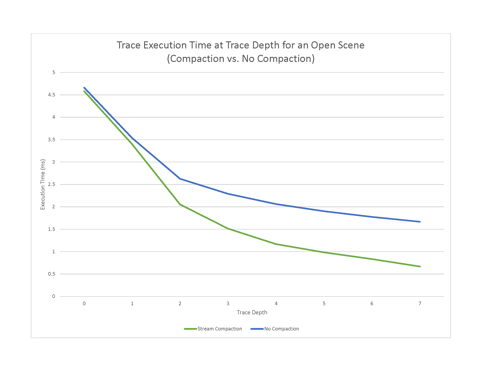
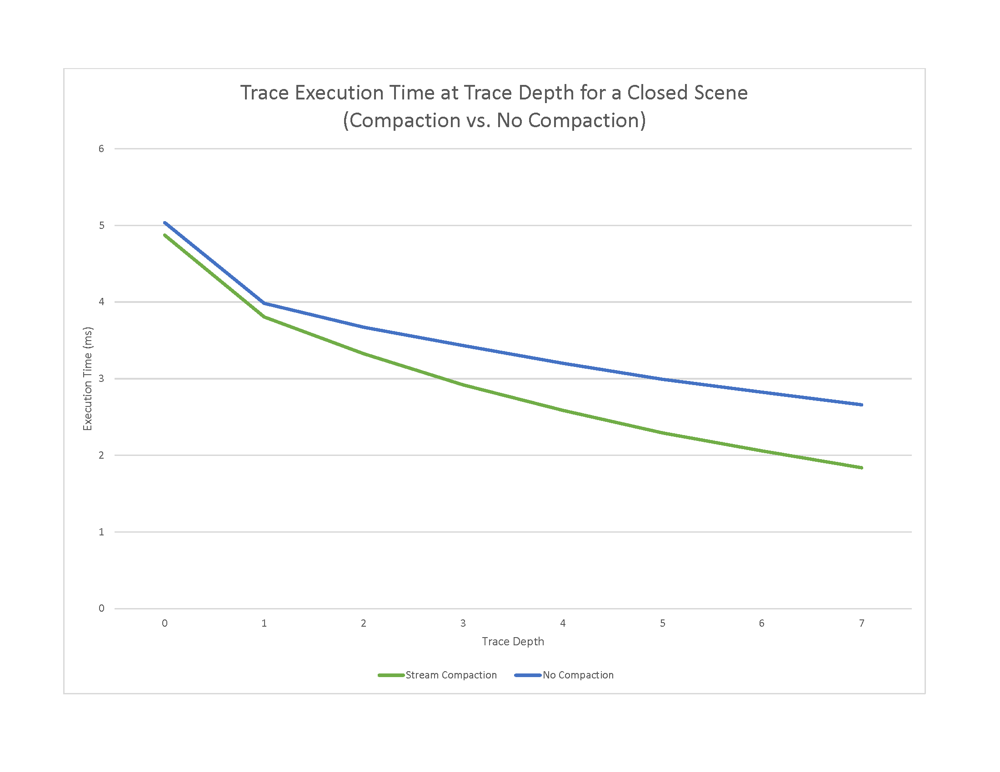

CUDA Path Tracer
================

**University of Pennsylvania, CIS 565: GPU Programming and Architecture, Project 3**

* Bradley Crusco
* Tested on: Windows 10, i7-3770K @ 3.50GHz 16GB, 2 x GTX 980 4096MB (Personal Computer)

## Description

## Features

### Raycasting

### Diffuse Surfaces

### Perfectly Specular Reflective Surfaces

### Work Efficient Stream Compaction

### Refractive Surfaces??

### Depth of Field

### Non-Perfect Specular Surfaces

### Motion Blur

Features:
ray casting/ antialiasing?
Diffuse surfaces?
Perfectly specular reflective surfaces?
shared stream compaction?
Refraction
Depth of field
Non-perfect specular surfaces
motion blur

Instructions on building / controlling
Scene file format instructions
