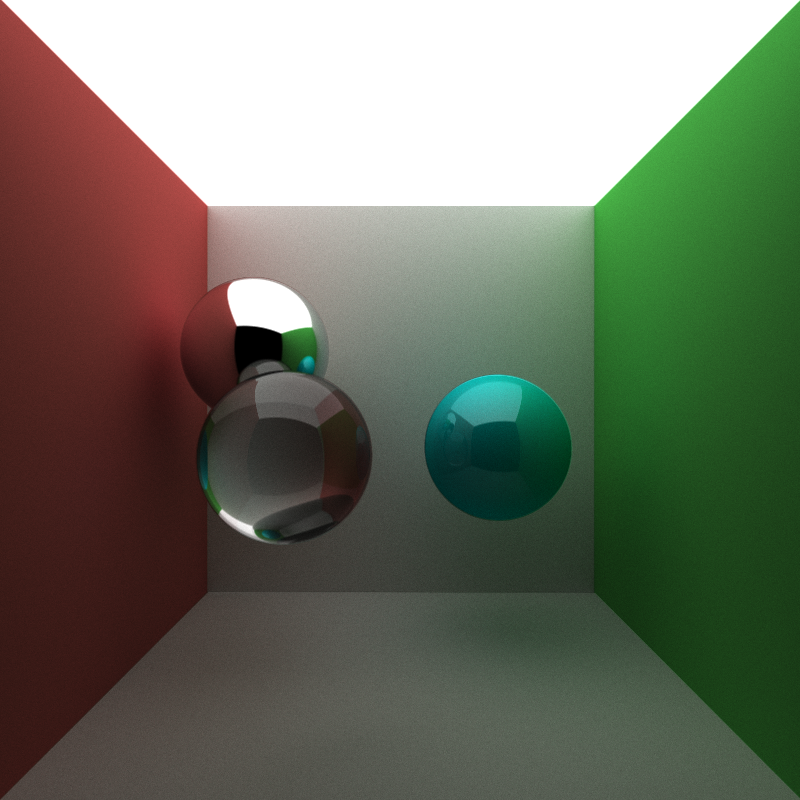
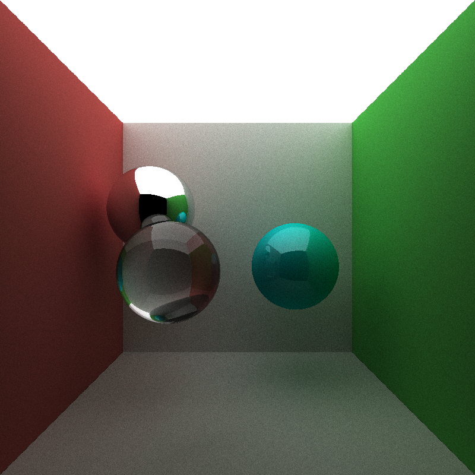
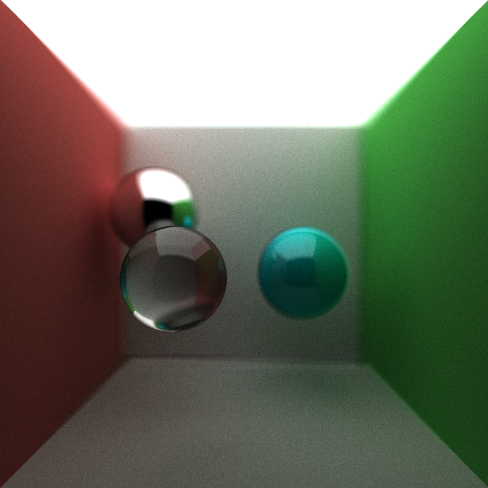
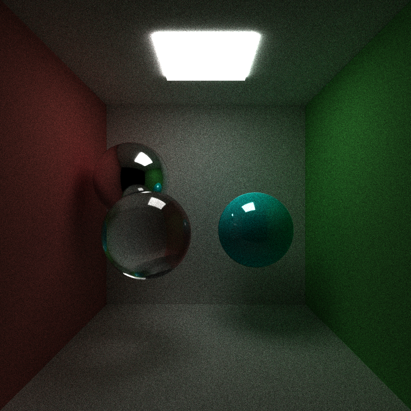
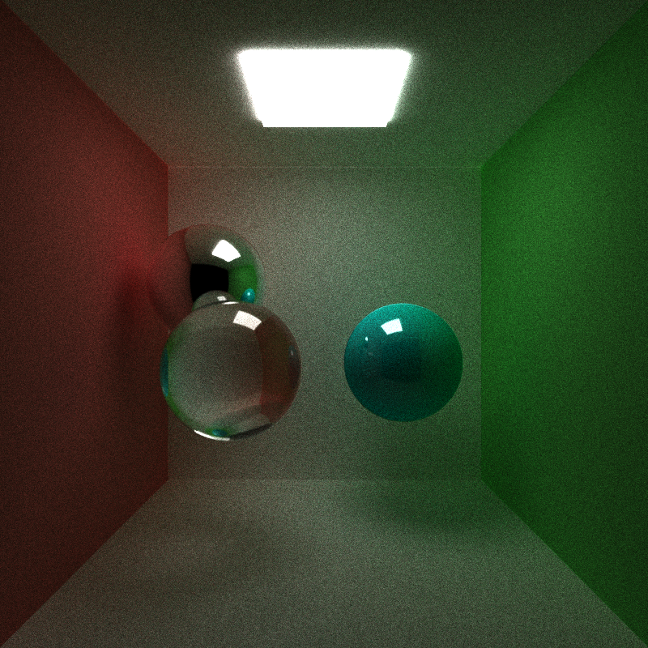
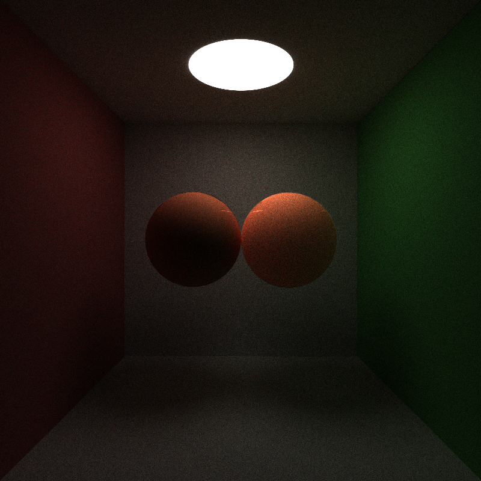
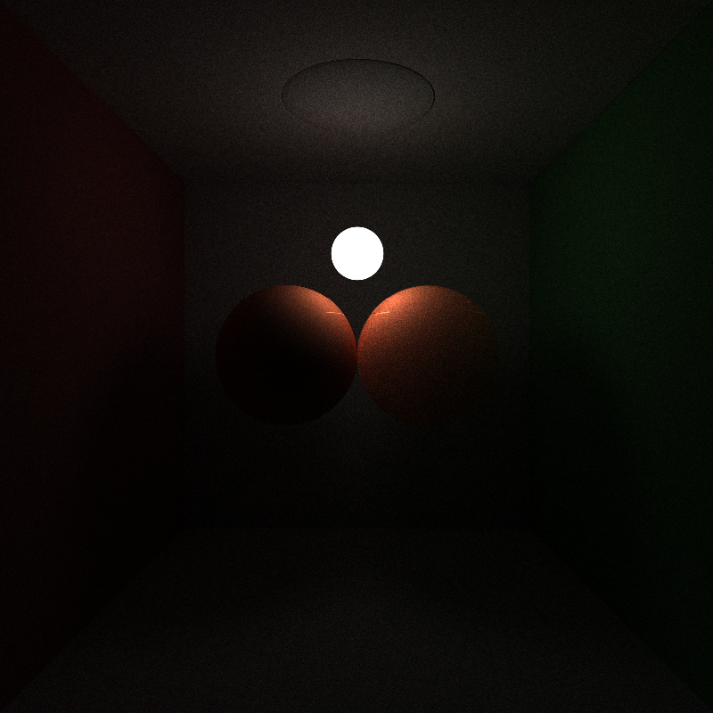
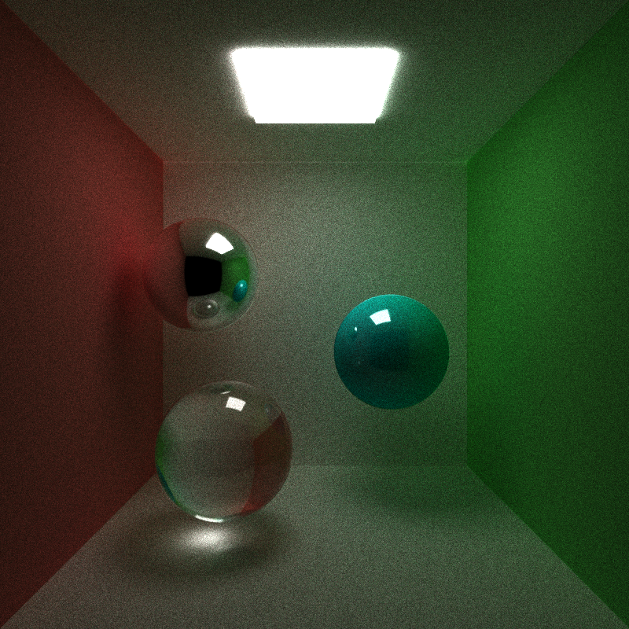
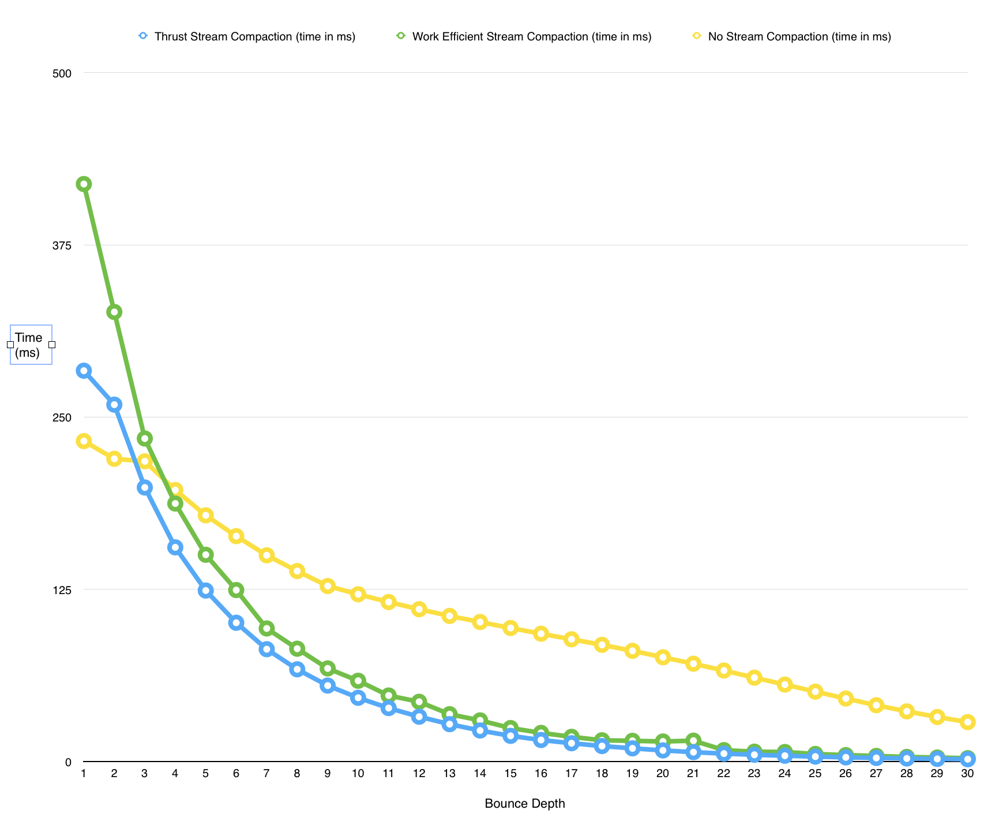

CUDA Path Tracer
================

**University of Pennsylvania, CIS 565: GPU Programming and Architecture, Project 3**

* SANCHIT GARG
* Tested on: Mac OSX 10.10.4, i7 @ 2.4 GHz, GT 650M 1GB (Personal Computer)

### What is a Path Tracer ?

A path tracer is a Global Illumination algorithm for rendering.
The basic setup of the path tracer is that you have a camera, an image to write to and a scene to by rendered. Our aim is to find image pixel colors based on what the camera would be looking at that pixel. To do so, we shoot rays from the camera into the scene, get the intersection points from the scene and based on the material of the intersected object, set the pixel color. This is done over multiple iterations to get a physically correct global illumination. On every iteration, we bounce the ray multiple times based on the material to get a good approximation for a pixel. As every ray is independent of the other, this becomes an embarrassing parallel algorithm.

### Contents

Note: The code is build up on the framework provided by our TA, Kai for the CIS 565 class.

* `src/` C++/CUDA source files.
* `scenes/` Example scene description files.
* `img/` Renders of example scene description files.
* `external/` Includes and static libraries for 3rd party libraries.

#### Controls

* Esc to exit.
* Space to save an image. Watch the console for the output filename.
* W/A/S/D and R/F move the camera. Arrow keys rotate.

## Features

In this project, I aimed at implementing a CUDA base Path Tracer. The features implemented in the project are:

* Ray parallel path tracing over the GPU
* Anti Aliasing
* Basic diffused surface
* Specular surfaces implemented by sampling a light source at random
* Mirror surface
* Refractive surfaces implemented with Fresnels reflectance
* Depth of field
* Direct Illumination by sampling a light source at random
* Subsurface Scattering
* Work Efficient stream compaction with shared memory to remove dead rays quickly
* Effects like color bleeding, caustics, soft shadow can be observed

### Implementation Details

Let us look at the method used to implement each of the features:

##### Ray parallel path tracing over the GPU ->
As mentioned above, this is an emabarrisingly parallel algorithm as all rays are independent of each other. Hence we can send all the rays in parallel to a CUDA kernel for color calculations.

##### Anti Aliasing ->
A pixel is not a point but a small square area. It is possible that more than one color exists in a pixel and hence the color of the pixel should be the average of all these colors. If we always sample the center of the pixel, we will get the same color and the edges in our final render would be stairstepped. This is called aliasing. To overcome this problem, I jitter the pixel sampling point to select random points within a pixel area. This gives us a better approximation of the color at that pixel and hence a better render. This is called antialiasing. You can see the comparison between the Aliased and an Antialiased image below:

 

##### Diffused Surface ->
For a good approximation of the color at a diffused surface, we need to bounce the ray in all possible directions and average the contributions of the color values of all these rays. To get the bounce direction, we take a direction in a hemishpere in the direction of the intersection normal (code provided). This acts as the ray direction for the next iteration.

##### Specular Surface ->
To get a specular highlight, we calculate the color based on the half angle and the specular exponent. To get the half angle, we have to get the ray going to a light. Now as the light is an area light, we sample a random point on the light source to get the light vetor.
Now to decide of the color of the this ray would be a specular or a diffused contribution, we generate a random number between 0 and 1 and take a 30-70 split between the rays. Hence 30% rays contribute specular and 70% contribute diffused. This gives us a desired result.

##### Mirror Surface ->
To get a mirror like effect, we reflect the incoming ray from the surface with respect to the normal.

##### Refractive Surface and Fresnels Reflectance ->
Materials like glass, water etc are refractive surfaces. To implement this, I take the incoming ray and refract it with inside the object. Next, I take this ray and refract it again to go come out. This gives us a transparency like effect. Make sure you feed the correct refractive indices to the refract function.
To make the refraction more physically correct, I implemented Fresnels reflection. As per this law, any incoming light is both refracted and reflected by some amount. The probability of each happening is based on the refractive index of the object. For the calculations I refered to PBRT Page 435. This gave me the probability split between reflection and refraction. The next step is to implement both and add their contributions based on the probability. To make a material display fresnel property, make the flag for both refraction and reflection to 1 in the scene file (explained below).

 

##### Depth of Field ->
This is a very interesting effect that can be observed in many photographs where some part of the image is in sharp focus while the other is blurred out. To implement this effect, I used the focal length and aperture parameters of the camera. Assume that there is a sphere centered at the camera position and of the radius of the focal length. We get the intersection of all intitial rays with this sphere. Next, we keep this as the final point but jitter the ray's origin based on the aperture of the camera. The new ray direction will be from this jittered origin to the intersection point. What happens now is that all the points wihtin that focal length are in focus but all others are out of focus. To enable Depth of Field, make the DOF flag to 1 in `pathtrace.cu`.

 

##### Direct Illumination ->
The concept of direct illumination is that if any ray is alive after the ray depth, then we can take that ray directly to the light. If it can reach the light then we add its contribution to the final image. This helps in generating better looking renders. Also, we can reduce the trace depth and get a similar result with direct illumination.
The important part of this is sampling the lights. For this I borrowed the code from CIS 560 to sample cubes and spheres. First I randomly select a light and then take a random point on that light. This gives me a good sampling of all the light sources. To enable Direct illumination, make the DI flag to 1 in `pathtrace.cu`.

 

##### Subsurface Scattering ->
Getting physically accurate subsurface scattering effect is very expensive to compute (Algorithm explained in PBRT). I tried to hack around it got a decent effect.
In my method, I get a random reflection direction within the hemishpere from the intersection point. Then I move the ray in this direction by some distance which is the SSS value in the scene file. Now I create a new ray that goes from this point to the center of the object. I find the intersection of this ray with the same object and get the new point on the geometry. This point acts as the origin for the ray bounce. To get the direction, I choose a random ray direction in the hemisphere. 
For better visual results, I took a 50-50 split between the sub surface scattering and diffused bounce. This gives me some nice results as shown below. The sphere on the left is diffused while the one on the right shows sub surface scattering properties.

 

##### Work efficient Stream Compaction ->
In the path tracer, the rays that do not hit any object or hit a light are considered to be dead. If we hit the light then we are done and we can add the color to the corresponding pixel. If it does not hit anything then also we are done. So we mark all these rays as dead. In the next step, we have to remove all these rays from our array and consider only the one's that are alive. The work efficient stream compaction helps speeding this process by doing it in parallel over the shared memory of a block.

##### Color Bleeding, Caustics and Soft Shadow ->
These are real life effects that we get for free with the path tracer. In the images you can see that the red and green color of the surrounding bleeds into the white back wall giving it a little color. 
Caustics is observed with refractive materials. When the light goes through a refractive surface, it gets concentrated on the other side. This can be observed in the image.
Soft shadows can be observed because we have area lights.

### Scene File Format

The project needs to be fed a scene description. It includes camera parameters, material properties and geometry description. Any part of the file can be commented using C style '//' comments. This is done as a text file and follows the following format:

Materials are defined in the following fashion:

* MATERIAL (material ID) //material header
* RGB (float r) (float g) (float b) //diffuse color
* SPECX (float specx) //specular exponent
* SPECRGB (float r) (float g) (float b) //specular color
* SSS (float trans) //translucence value, 0 for no, > 0 for yes
* REFL (bool refl) //reflectivity flag, 0 for no, 1 for yes
* REFR (bool refr) //refractivity flag, 0 for no, 1 for yes
* REFRIOR (float ior) //index of refraction for Fresnel effects
* EMITTANCE (float emittance) //the emittance strength of the material. Material is a light source iff emittance > 0.

Cameras are defined in the following fashion:

* CAMERA //camera header
* RES (float x) (float y) //resolution
* FOVY (float fovy) //vertical field of view half-angle. the horizonal angle is calculated from this and the reslution
* ITERATIONS (float interations) //how many iterations to refine the image, only relevant for supersampled antialiasing, depth of field, area lights, and other distributed raytracing applications
* DEPTH (int depth) //maximum depth (number of times the path will bounce)
* FILE (string filename) //file to output render to upon completion
* FOCAL (float f) // focal lenth of the camera
* APER (float a) // aperture of the camera
* EYE (float x) (float y) (float z) //camera's position in worldspace
* VIEW (float x) (float y) (float z) //camera's view direction
* UP (float x) (float y) (float z) //camera's up vector

Objects are defined in the following fashion:

* OBJECT (object ID) //object header
* (cube OR sphere OR mesh) //type of object, can be either "cube", "sphere", or "mesh". Note that cubes and spheres are unit sized and centered at the origin.
* material (material ID) //material to assign this object
* TRANS (float transx) (float transy) (float transz) //translation
* ROTAT (float rotationx) (float rotationy) (float rotationz) //rotation
* SCALE (float scalex) (float scaley) (float scalez) //scale
* OBJFILE (string filename) // obj file path if using a mesh (NEXT STEP)

The scene files can be found in the `scene/` folder.

### Analysis on Stream Compaction

Here I have done an analysis for stream compaction and how it helps make the path tracer faster. I compared my excution time for one iteration for a 1600x1600 image for a depth of 30. The time were compared for the case of no stream compaction, for stream compaction with thrust and for the work efficient stream compaction implemented using shared memory. The results are as follows :

The graph clearly shows that both the stream compaction implementations are better than the case with no stream compaction. This is because we only send the live rays in the next depth when we do stream compaction. In the case of no stream compaction, all the rays are send to the kernel. This wastes CPU kernels and hence the implementation is slower.
  
  
### Next Steps
Building up on my current code, I plan to implement the following things :
* Mesh geometry: Using the assimp library, I plan to import obj meshes in the scene to get awesome renders
* Non perfect specular: This is easy to implement and would give me good physically correct specular highlights.
* Make it fast: And yes, optimize the code futher to make the renderer even faster.