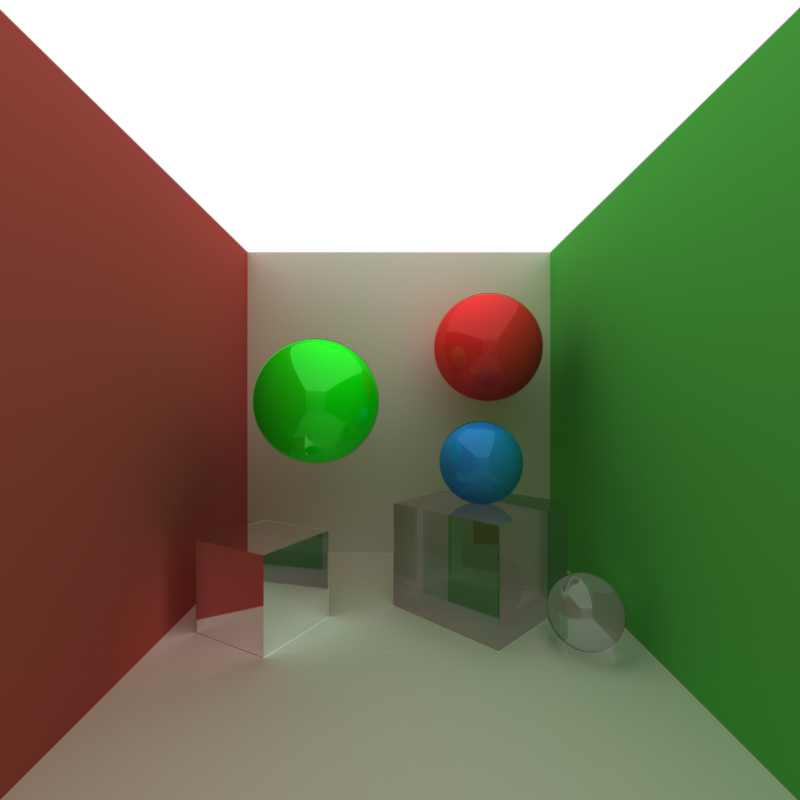

CUDA Path Tracer
================

**University of Pennsylvania, CIS 565: GPU Programming and Architecture, Project 3**

* Bradley Crusco
* Tested on: Windows 10, i7-3770K @ 3.50GHz 16GB, 2 x GTX 980 4096MB (Personal Computer)

## Description
An interactive GPU accelerated path tracer with support for diffuse, specular, mirrored, and refractive surfaces. Additional features include depth of field and motion blur effects.

## Features

### Raycasting and Anitaliasing
The camera in my project follows the "pinhole" model. All the rays are shot from the same position (the eye of the camera), and each is shot at a unique pixel on an image plane. Within each of these pixels, we "jitter" the point within the pixel the ray will shoot through calculating a random value within the pixel's dimensions. This gives us antialiasing, which removes sharp "jaggies" that you'd otherwise see on the edges of the objects in my scene.

### Diffuse Surfaces
Diffuse surfaces are supported using a cosine weighted random direction calculation.

### Perfectly Specular Reflective Surfaces

Perfectly specular surfaces give a mirrored effect and are created by combining a specular light component with the calculation of the direction of a ray off a mirrored object.

### Work Efficient Stream Compaction

### Depth of Field
* **Overview**: When depth of field is disabled, my path tracer acts line a "pinhole camera". All the arrays come from a single point and are shot into each pixel of an image plane. Depth of field integrates over a lense to achieve its effect, dropping the pinhole implementation. I added two new configuration options to the camera in my scene files, focal distance and aperture radius. Focal distance specifies how far away from the camera is the image in focus, and replaces the idea of the image plane. And the aperture radius determines the severity of the effect (the blur of everything not at the focal distance).
* **Performance Impact**: Neglegable. There is a few more calculations for depth of field than the standard pinhole implementation, but they are not major and they only take place when the rays are being created for the first bounce. So the calculation will happen only once per iteration.
* **GPU vs. CPU Implementation**: The calculations for depth of field take place during the creation of my rays. This is the part of the code where the GPU and CPU implementations are most similar (the only difference being we can do it in parallel on the GPU). So the specific depth of field calculations should be the same for either implementation, but it will just run faster on the GPU.

### Non-Perfect Specular Surfaces

* **Overview**: Non-perfect specular surfaces, which gives a glossy effect, are created using a probability distribution between the diffuse and specular component of a material. First a probability of either a diffuse or a specular ray bounce occuring is calculating by weighting the intensity of the diffuse and specular color values respectively. A random value between 0 and 1 is then generated, which I use to choose a bounce type. The corresponding ray bounce direction is then calculated, as is the color, which is the given color provided by the scene file multiplied by the inverse probability that this bounce occured.
* **Performance Impact**: Neglegable. The only additional calculation to be done is the calculation of the ratio between both color intensities. There is a conditional, which may have performance impact, but this method only calculates one color and one ray bounce just like the mirrored and diffuse implementations.
* **GPU vs. CPU Implementation**: A CPU implementation would likely be recursive, where my GPU implementation is not. Because of this I use a probability calculation to determine how to bounce and only do the bounce once. Since the CPU implementation is recursive, it would likely trace both the specular and diffuse bounces instead of just picking one, and then use the ratio to determine the weights of the resulting color. So for the CPU implemenation I would expect dramatically more performance requirements for this feature than my GPU implemenation.

### Refractive Surfaces with Fresnel Effects

* **Overview**: This is calculated in much the same way as non-perfect specular surfaces. We figure out a probability that a ray hitting our refractive surface will either bounce off and reflect or pass into and refract through the object. If it reflects, we calculate the mirrored reflection direction, and if it refracts we calculate the ray direction using [Snell's law](https://en.wikipedia.org/wiki/Snell%27s_law). The main difference is in the calculation of this probability. We calculate the Fresnel reflection coefficient using [Schlick's approximation](https://en.wikipedia.org/wiki/Schlick%27s_approximation) (the inverse of which is the refraction coefficient). An index of refraction, specified in the scene files, determines the refractive properties of the respective material. Air has an index of refraction of 1, and glass about 2.2. It is important to keep track of whether a ray is going into an object or coming out of it, as the indexes are used in a ratio, and the ordering changes depending on what is being exited and what is being entered.
* **Performance Impact**: Significant. Compared to non-perfect specular surfaces, we have many more calculations to do to figure out the respective reflection and refraction coefficients. In addition, if a ray hits a refractive object at a perpendicular angle, the ray is always reflected, regardless of our reflection and refraction coefficients. This is another additional calculation that adds to the performance demands.
* **GPU vs. CPU Implementation**: As far as comparing my GPU implementation to what I'd expect a CPU implementation to be, it'd be the same as the comparison for non-perfect specular surfaces, except in this case the performance increase would be much more significant because it would have to make the additional calculations for the Fresnel coefficients.
* **How to Optimize**: To keep track of whether a ray was inside or outside of an object so I could know how to use the index of refraction coefficients (the air and the other object) I added a boolean to my Ray struct that held this state. This significantly added to my memory overhead because I'm using so many Ray's. I'd like to come up with a way to determine this property on the fly without saving it to further optimize performance.

### Motion Blur
* **Overview**: Motion blur is very conceptually simple. We merely transform an object's position over the course of our render. This creates a blur effect because we are sampling the object at different locations, which creates a blurry trail as the object moves across the screen. Implementation was less trivial however, as originally I was not planning to support it and my geometry implementation did not support moving objects. To avoid changing a significant amount of code, I made a MovingGeom struct in addition to my original Geom struct to represent geometry that was moving. Since my path tracing implementation didn't have a concept of this MovingGeom, on every iteration before I begin path tracing I update the standard Geom of any object marked to be blurred, then trace as if it was static. The one additional change that was made to support this was a change to my scene files. It now requires "frame" tags to be added before transformation data. Two sets of data are expected, labeled "frame 0" and "frame 1", respectively. For objects that have motion blur enabled for them, these represent the starting and ending positions of the object.
* **Performance Impact**: Significant. The impact on the actual path tracing itself is nonexistent. There's no additional calculations, the objects we are intersecting with just happen to be in a different location. My specific workaround implementation to support a MovingGeom has significant consquences for memory bandwidth, as it demands that I load new Geom data on each iteration. Geoms can be very large, and are already a memory bottleneck, so this is less than ideal. If I want to eventually support arbitrary mesh models, I'll have to come up with a new implementation.
* **GPU vs. CPU Implementation**: The way I am calculating the motion blur effect is independent of how I am doing my path tracing, so there should be no difference between the CPU and GPU implementations.
* **How to Optimize**: As said above, the main space to optimize is the memory management of the MovingGeoms and Geoms. One more simple optimization, that is short of changing the entire project to support MovingGeoms, that might have a large effect is to store the MovingGeoms on the device memory instead of the host memory. As of now a transfer from host to device is required on every iteration, causing a big bottleneck. That bottleneck would at least be eliminated with this change. 

## Analysis
### Stream Compaction: Open vs. Closed Scenes

#### Active Threads Remaining at Each Trace Depth

#### Trace Execution Time at Each Trace Depth

### Stream Compaction: Compaction vs. No Compaction

## Interactive Controls

## Scene File Format 
Add something on included scenes
