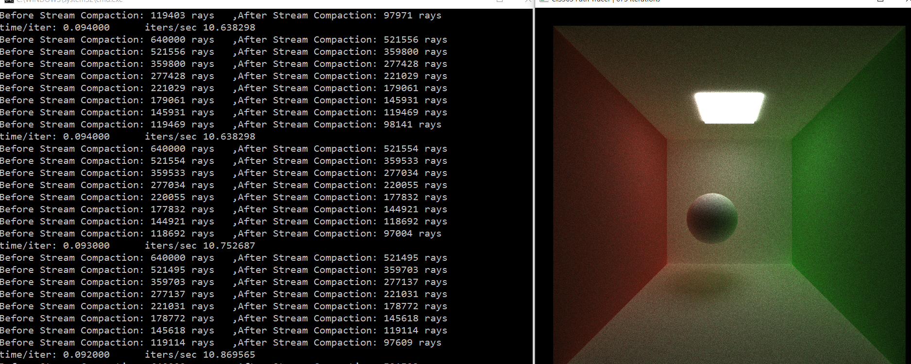

CUDA Path Tracer
================

**University of Pennsylvania, CIS 565: GPU Programming and Architecture, Project 3**

* Ziwei Zong
* Tested on: Windows 10, i7-5500 @ 2.40GHz 8GB, GTX 950M (Personal)

Description
========================
--------------------------
## Overview

This GPU based path tracer with global illumination and anti-alising can render diffuse, perfect/non-perfect specular, transparent and subsurface scattering materials with textures. Shown as the picture below.

--------------------------
## Features

### Materials

Below are material types that this path tracer supports:
 * **Diffuse**
 * **Specular**
     * Perfect Specular (Mirrors)
     * Non-perfect Reflection
 * **Transparent (with fresnel reflection)**
 * **Subsurface Scattering**
     * Diffuse Subsurface
     * Subsurface with reflection

 
 
#### Subsurface Scattering

Subsurface scattering is implemented based on Yining Karl Li's [Slides](https://github.com/CIS565-Fall-2015/cis565-fall-2015.github.io/raw/master/lectures/4.1-Path-Tracing-1.pdf).
And [BSSRDF Explorer: A rendering framework for the BSSRDF](http://noobody.org/bachelor-thesis.pdf)

 Subsurface Scattering	|  Compare with diffuse
:----------------------:|:-------------------------:
		|

### Texture Mapping

Cube Texture Mapping Test |Sphere Texture Mapping test
:------------------------:|:---------------------------:
|

### Global Illumination

For rays that reached the camera depth, check the intersection point if it is directly shined by any lights.
Global Illumination helps rendering more realistic pictures.

With Direct Lighting	|  Without Direct Lighting
:----------------------:|:-------------------------:
|

#### Anti-aliasing

Choose a random direction inside each pixel to smooth edges while iterating.

With Anti-Aliasing		|Without Anti-Aliasing
:----------------------:|:------------------:
 |

### Work-efficient Stream Compaction with Shared Memory

For below's screenshot, it is an open scene with camera's depth 8, resolution 800*800.
The number of rays reduces from 640000 to 97004 after 8 depth's bouncing.

--------------------------
## Analysis
**Open vs Closed scenes**

In an open scene, many rays interact with nothing after several bounces. 
Thus using stream compaction can optimize the render process when depth is larger than a certain value.
 

However, when the scene is closed, only very small amount of rays get terminated even if there are a great amount of bounces.
For this condition, the advantages of reducing ray numbers by sream compaction cannot trade off the calculation and memory accessing time.
Therefore, as expected, stream compaction performs poor for closed scenes.

--------------------------
## Appendix
#### Command line

		<%s>		|	 <"s">
	scene file path	|(with/without) turn on/off stream compaction

* example:

	../cornell.txt s			//with stream compaction
	../cornell_closed.txt	//without stream compaction

#### Controls

* Esc to save an image and exit.
* Space to save an image. Watch the console for the output filename.
* W/A/S/D and R/F move the camera. Arrow keys rotate.

#### Scene File

This project uses a custom scene description format. Scene files are flat text
files that describe all geometry, materials, lights, cameras, textures and render
settings inside of the scene. 

Materials are defined in the following fashion:

* MATERIAL (material ID)				//material header
* RGB (float r) (float g) (float b)		//diffuse color
* SPECX (float specx)					//specular exponent
* SPECRGB (float r) (float g) (float b) //specular color
* REFL (bool refl)						//reflectivity flag, 0 for no, 1 for yes
* REFR (bool refr)						//refractivity flag, 0 for no, 1 for yes
* REFRIOR (float ior)					//index of refraction for Fresnel effects
* EMITTANCE (float emittance)			//the emittance strength of the material. Material is a light source iff emittance > 0.
* BSSRDF (float bssrdf)					//value of Sigma_t for subsurface materials
* TEX (string)							//file path for the texture, put "NULL" if no texture for this material

#### Future Work

* Load arbitrary meshes
* Bump & Displacement Mapping
* Depth of field

#### Base Code

[CIS565-Fall-2015/Project3-CUDA-Path-Tracer](https://github.com/CIS565-Fall-2015/Project3-CUDA-Path-Tracer)

#### References

* Yining Karl Li's [Slides](https://github.com/CIS565-Fall-2015/cis565-fall-2015.github.io/raw/master/lectures/4.1-Path-Tracing-1.pdf)
* [BSSRDF Explorer: A rendering framework for the BSSRDF](http://noobody.org/bachelor-thesis.pdf)