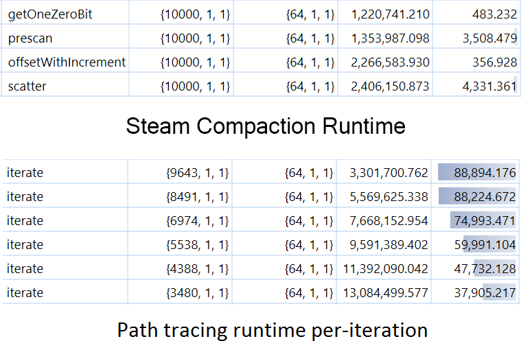

CUDA Path Tracer
================

**University of Pennsylvania, CIS 565: GPU Programming and Architecture, Project 3**

* Ratchpak (Dome) Pongmongkol
* Tested on: Windows 10, i7 @ 2.4GHz 16GB, GT 650M 1024MB (rMBP Early 2013)

GPU Path Tracer
========================
Path tracer is one way of rendering a CG scene. This time, we do it on GPU 
(which has wayyyy higher throughput)

In the beginning of each iteration, we calculate rays that are shot from the camera 
through each pixels, and then stored it inside an array on the GPU (global memory).

Next, we find if the ray intersects with any surfaces. If the ray intersects with 
any surfaces, we recalculate the ray based on the surface's "material" property 
(i.e. which direction should the ray go next?) and collect the "color" that will be
displayed on the pixel the ray is shot from. The ray's origin will now be the 
intersection point, and it will bounce until it hits the light source, not hitting
anything (going out of the scene into the dark dark space), or reach the maximum 
depth we set (to prevent from infinity bounce, which might happen in a scene like
two mirrors facing each other.) 

## FEATURES

## TWEAK

### Work Efficient Steam Compaction

At the end of each depth, our "Steam Compaction" function will remove the rays that 
are marked as "terminate" out, so that there are less rays to go through and compute (=faster!)

This is done by first marking the active rays as '1' and the terminated rays as '0'. If we do a
scan (i.e. compute the accumulated sum), we will get the new 'pointer' of the active rays, so that
we can copy it to a new array and get rid of the terminated ones.

To reduce the global memory's bandwidth bottleneck, I implement the steam compaction function
with Shared Memory. However, given the length of the ray array (equals width x length - 
640000 for a 640x640 image in the beginning of every iteration), it needs to be  divided into 
small sets to fit each block, perform a scan on each block, then compute the offset by pulling out
the biggest number in each block into another array to be scanned. If this array is still too large,
it needs to go through the same process (recursively). After the offset array is scanned, we add
the sorted number back to all the member of each blocks, and then we will get an array with
accumulated sums.

From CUDA performance profiler, we can see that the amount of time spent (rightmost column) per itration are significantly reduced (bottom), even when compared with the time spent on steam compaction in the first iteration (top)

Since steam compaction's benefit is to reduce the number of rays we need to go through, it will
only benefit in the scene that such conditions happen. (i.e. if we put the camera in a 6-sided
mirror box with a lot of object that blocks the ray from reaching the light source, 
steam compaction might be a drag instead.)

## REFERENCES

- Patrick Cozzi's lecture notes (https://github.com/CIS565-Fall-2015/cis565-fall-2015.github.io)
- [PBRT] Physically Based Rendering, Second Edition: From Theory To Implementation. Pharr, Matt and Humphreys, Greg. 2010
