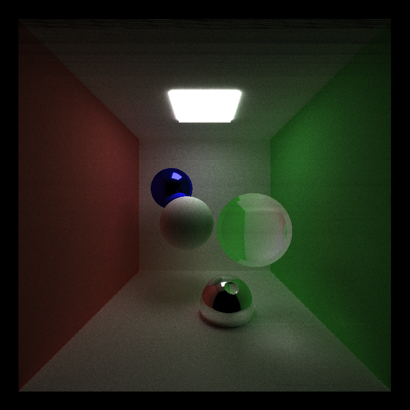

CUDA Path Tracer
================

**University of Pennsylvania, CIS 565: GPU Programming and Architecture, Project 3**

* Kangning Li
* Tested on: Windows 10, i7-4790 @ 3.60GHz 16GB, GTX 970 4096MB (Personal)

This repository contains a CUDA path tracer with the following features:
- basic diffuse and perfectly reflective materials
- work-efficient shared memory scan for stream compaction
- obj file loading and naive rendering
- motion blur

This was done as HW3 for CIS 565 2015, GPU Programming at the University of Pennsylvania.

**Materials**

The content of this assignment was weighted more towards learning CUDA than pathtracing. As such, this path tracer only supports perfectly reflective and perfect "diffuse" materials at the moment. Code in interactions.h exists with the intent to enable support in the future for simple refraction as well as fresnel reflection/refraction approximated using Schlick's law. However, these features are not complete as can be seen below:

We can still get some interesting images, however, such as this one with an interesting lensing effect:

Another observation: a scene with brighter RGB lights on a diffuse surface produces CMYK shadows!

All lights are just geometry objects with an emissive material. I will elaborate on the scene file format further down.

**Stream Compaction**

Within one sampling iteration the GPU will produce a pool of rays by raycasting. Then it will repeatedly test the rays for intersection in the scene and remove bottomed out rays until the pool is empty.

Removing bottomed out rays from the pool uses stream compaction. This program includes a work-efficient shared memory implementation of Scan but can also be configured to use work-efficient global memory scan or the thrust library's version of stream compaction.

The work-efficient scan implementations are available in [stream_compaction/efficient.cu](stream_compaction/efficient.cu). The function scan_components_test() also contains some unit tests for the components of work-efficient global memory scan. The shared memory size can be changed by tweaking DEVICE_SHARED_MEMORY in [stream_compaction/efficient.h](stream_compaction/efficient.h).

Stream compaction meanwhile is implemented in [src/pathtrace.cu](src/pathtrace.cu). To switch between different stream compaction implementations, see [line 362](src/pathtrace.cu#L362).

It's worth noting that both of my implementations of stream compaction seem to cause artifacts in the render. The thrust implementation, however, does not feature such problems. The reasons for this are somewhat nonobvious, as my unit tests on shared memory stream compaction seem to make sense and cover both power-of-two and non-power-of-two.

Here is a render using thrust:

And here is the same scene rendered using the work-efficient shared memory implementation:

Unit tests for work-efficient shared memory implementation can be run on the first path tracing iteration by uncommenting code at line 296 in [src/pathtrace.cu](src/pathtrace.cu#L296).

**Scene File Changes**

The scene file format has some extensions from the original format described [here](https://github.com/CIS565-Fall-2015/Project3-CUDA-Path-Tracer#scene-file-format).

My modifications exist to enable motion blur and arbitrary obj file loading. The scene file [scenes/toBoldlyGo.txt](scenes/toBoldlyGo.txt) is a pretty representative example.

At [line 51 and 52](scenes/toBoldlyGo.txt#L51) I added CAMERATIME and SHUTTERDURATION, which define the current "world" time in the path tracer world and how long the camera shutter stays open in milliseconds. [Line 106](scenes/toBoldlyGo.txt#L106) defines a translational "speed" for the object as distance in world units traveled per millisecond. When a SPEED is defined, the object's original TRANS value will be treated as its initial position.

[Line 110](scenes/toBoldlyGo.txt#L110) simply includes the file name of the obj file to be loaded.

**Motion Blur**

This is a scaled cube:

And this is a very fast scaled cube:

Implementing motion blur required modifying the scene primitives' intersection functions and storing temporal data with each ray. At ray cast time, a camera with a SHUTTERDURATION value will "jitter" the cast rays between the CAMERATIME it currently has stored and CAMERATIME + SHUTTERDURATION.

When an intersection test is run between a ray and a scene primitive, the primitive's transformation is recalculated to accomodate the translation from the initial position calculated from the ray's timestamp and the primitive's SPEED.

Motion blur does not add samples like anti-aliasing and depth of field do, so it should not cause orders of magnitude performance loss per iteration. However, it may increase noise for the same number of samples since the samples are spread out "over time".

**Mesh loading**

The mesh loading and rendering in this project are both very straightforward. All the host mesh loading code can be found in [src/Mesh.cpp](src/Mesh.cpp), which expects meshes that have already been triangulated and have indices in counter clockwise order.

At the moment rendering scenes with meshes causes drastic performance decreases compared to rendering scenes with sphere and cube primitives. In addition to the additonal number of intersection tests that must be done in naive mesh rendering (every triangle must be checked against every ray), the mesh is also stored exclusively in device global memory, slowing down access time.
