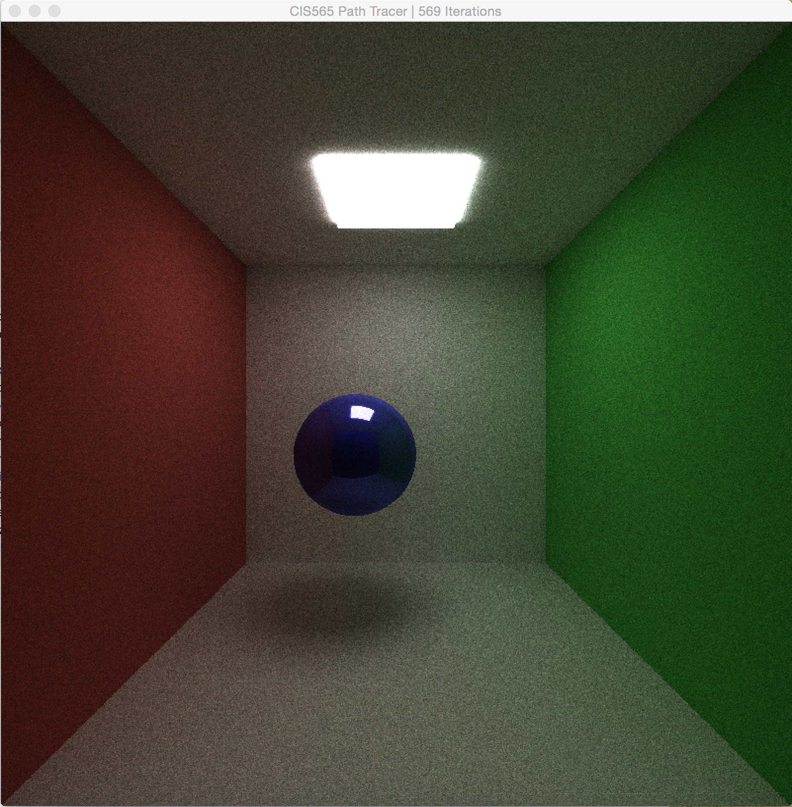
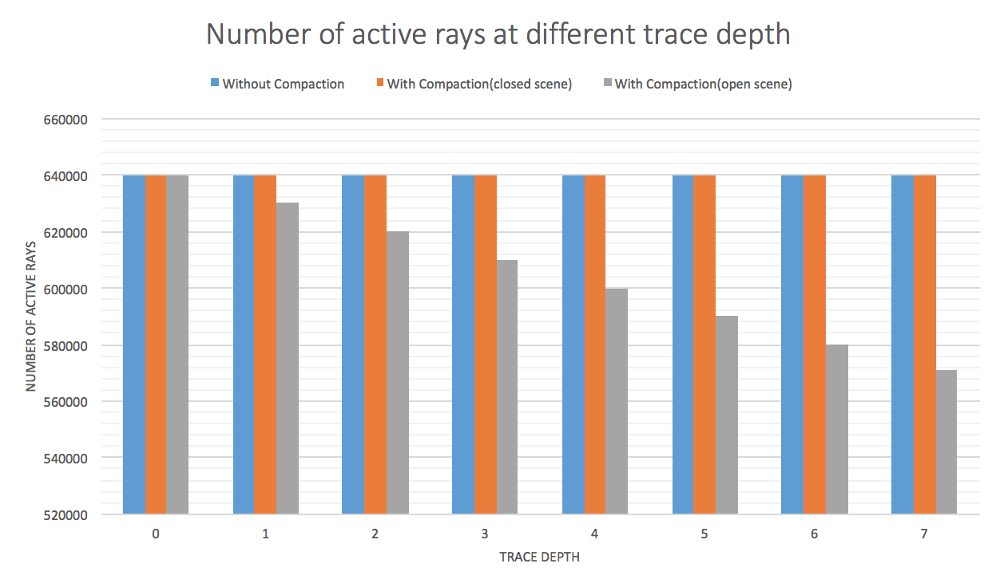

CUDA Path Tracer
================

**University of Pennsylvania, CIS 565: GPU Programming and Architecture, Project 3**

* Guan Sun
* Tested on: Mac OS X Yosemite 10.10.5, Intel Core i7 @ 2.3GHz 8GB, GeForce GT 650M 1024MB (Personal Laptop)

## Project Description:

In this project, a CUDA-based path tracer capable of rendering globally-illuminated images is implemented. The features include,
* Diffuse surfaces rendering
* Perfectly specular-reflective (mirrored) surfaces rendering
* Non-perfect specular surfaces rendering
* Antialiasing
* Motion blur
* Work-efficient stream compaction using shared memory

### Diffuse surface

### Perfectly specular-reflective surface

### Non-perfect specular surface

### Antialiasing

### Motion blur

### Work-efficient stream compaction

Work-efficient stream compaction removes all the terminated rays to improve the rendering performance. This figure shows how the number of
active rays changing as trace depth increases in one single iteration. From the figure we can come to the conclusion that stream compaction only improves the rendering performance of open scenes since in closed scenes the rays will never terminate before reaching the maximum trace depth.

## Running the code

The main function requires a scene description file. Call the program with
one as an argument: `cis565_path_tracer scenes/sphere.txt`.
(In Visual Studio, `../scenes/sphere.txt`.)

If you are using Visual Studio, you can set this in the Debugging > Command
Arguments section in the Project properties. Make sure you get the path right -
read the console for errors.

### Controls

* Esc to save an image and exit.
* Space to save an image. Watch the console for the output filename.
* W/A/S/D and R/F move the camera. Arrow keys rotate.

## Scene File Format

This project uses a custom scene description format. Scene files are flat text
files that describe all geometry, materials, lights, cameras, and render
settings inside of the scene. Items in the format are delimited by new lines,
and comments can be added using C-style `// comments`.

Materials are defined in the following fashion:

* MATERIAL (material ID) //material header
* RGB (float r) (float g) (float b) //diffuse color
* SPECX (float specx) //specular exponent
* SPECRGB (float r) (float g) (float b) //specular color
* REFL (bool refl) //reflectivity flag, 0 for no, 1 for yes
* REFR (bool refr) //refractivity flag, 0 for no, 1 for yes
* REFRIOR (float ior) //index of refraction for Fresnel effects
* EMITTANCE (float emittance) //the emittance strength of the material. Material is a light source iff emittance > 0.

Cameras are defined in the following fashion:

* CAMERA //camera header
* RES (float x) (float y) //resolution
* FOVY (float fovy) //vertical field of view half-angle. the horizonal angle is calculated from this and the reslution
* ITERATIONS (float interations) //how many iterations to refine the image,
  only relevant for supersampled antialiasing, depth of field, area lights, and
  other distributed raytracing applications
* DEPTH (int depth) //maximum depth (number of times the path will bounce)
* FILE (string filename) //file to output render to upon completion
* EYE (float x) (float y) (float z) //camera's position in worldspace
* VIEW (float x) (float y) (float z) //camera's view direction
* UP (float x) (float y) (float z) //camera's up vector

Objects are defined in the following fashion:

* OBJECT (object ID) //object header
* (cube OR sphere OR mesh) //type of object, can be either "cube", "sphere", or
  "mesh". Note that cubes and spheres are unit sized and centered at the
  origin.
* material (material ID) //material to assign this object
* TRANS (float transx) (float transy) (float transz) //translation
* ROTAT (float rotationx) (float rotationy) (float rotationz) //rotation
* SCALE (float scalex) (float scaley) (float scalez) //scale
* MOVING //define whether the object is moving or not
* TRANSGOAL (float transx) (float transy) (float transz) //translation of the movement goal
* FRAMES (int) //the frame span of the movement

Examples are provided in the `scenes/` directory: a single emissive sphere,
and a simple cornell box made using cubes for walls and lights and a sphere in
the middle.

## References

* [PBRT] Physically Based Rendering, Second Edition: From Theory To Implementation. Pharr, Matt and Humphreys, Greg. 2010.
* Upenn CIS565 lecture slides by Patrick Cozzi
* http://http.developer.nvidia.com/GPUGems3/gpugems3_ch20.html
* http://http.developer.nvidia.com/GPUGems3/gpugems3_ch39.html
