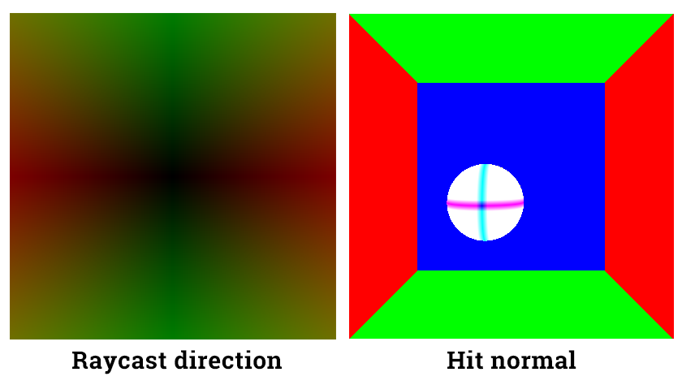
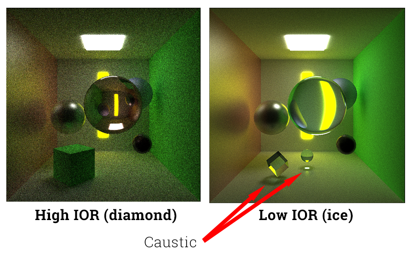

CUDA Path Tracer
================

**University of Pennsylvania, CIS 565: GPU Programming and Architecture, Project 3**

* Tongbo Sui
* Tested on: Windows 10, i5-3320M @ 2.60GHz 8GB, NVS 5400M 2GB (Personal)

## Overview
A GPU based path tracer that supports several common material effects. Stream compaction performance is optimized to loosely match that of Thrust.

## Features
* **Work-efficient stream compaction using shared memory**
  * Work-efficient stream compaction for arbitrary input size.
* **Raycasting**
  * Cast rays for each pixel from the camera into the scene through an imaginary grid of pixels
  * Casting to image plane at a distance calculated from camera FOV.

###### Raycasting debug. Left shows raycasting directions mapped from `(x,y,z)` to `(r,g,b)`. Right shows the first intersection normal.


* **Diffuse surfaces**
  * Cosine weighted diffuse reflection.

###### Diffuse and perfect specular surfaces. The perfect specular shown in this image is incorrect. It's been replaced by non-perfect specular implementation.


* **Non-perfect specular surfaces**
  * Cosine weighted reflection restricted by specular exponent. Perfectly specular-reflective (mirrored) surfaces would be a non-perfect surface with very large (toward positive infinity) specular exponent.
  * Instead of trying to find a biased function, simply jitter the reflection normal.
    * http://www.cs.cornell.edu/courses/cs4620/2012fa/lectures/37raytracing.pdf
  * *Performance impact*: about twice as many as computations needed. Execution time almost doubled.
  * *If on CPU*: looping through each pixel would have `O(n)` time with some constant `c`. This extra effect will increase `c` by at least 2x.
  * *Possible further optimization*: faster method for randomizing bounce direction; a better weight function for combining all possible effects.

###### Non-perfect specular surfaces. Higher specular exponent yields clearer reflection images.


* **Refraction with Frensel effects**
  * Refraction based on Index of Refraction (IOR), with reflection intensity approximated using Schlick's approximation.
    * https://en.wikipedia.org/wiki/Schlick's_approximation
  * *Performance impact*: extra calculations are needed as it calculates all possible effects for the material.
  * *If on CPU*: looping through each pixel would have `O(n)` time with some constant `c`. This extra effect increases the constant `c` dramatically, as it calculates both reflection and refraction, and split the iteration among diffuse, SSS, reflection, refraction.
  * *Possible further optimization*: faster method for randomizing bounce direction.

###### Refractions. Higher IOR results in more distorted images.


* **Subsurface scattering (SSS)**
  * Propagates light under object skin and send them off in randomized directions with an offset.

###### Subsurface scattering(SSS). Object "thickness" and distance to light source are two major factors of SSS intensity.


  * SSS for reflective material is also implemented.

###### Subsurface scattering(SSS) with reflections. Materials are combined to produce the end result.


  * *Optimization*:
    * Implementation is a simplified version of Dipole approximation.
      * https://graphics.stanford.edu/papers/bssrdf/bssrdf.pdf
    * Actual accurate SSS calculation would involve passing geometry object into the function and performing multiple extra intersection tests. This slows the entire rendering process by a factor of ~3. Major reason is that the geometry object is big in memory, and intersection tests are slow.
    * Reduced memory overhead by guessing ray-out position. Therefore intersection tests are not performed within the scatter method. Passing geometry all the way into scatter function is avoided.
    * If the guessed position is still inside the object (when it should be outside), it will be catched at the next trace depth, where the intersection point is automatically available. Color is multiplied by a factor to cancel out guessing failures.
  * *Performance impact*: like other material effects, it increases color calculation by a constant time due to extra computation on each pixel. Moreover, all extra material effects add execution time for the kernel. Due to the fact that warps can only execute all codes then mask out unwanted results, each additional effect equally add more tasks to each thread. Taking all effects (specular, refraction, SSS) in to account, the execution time increased by about 400% compared to a diffuse-only implementation.
  * *If on CPU*: looping through each pixel would have `O(n)` time with some constant `c`. This extra effect increases the constant `c` over the loop.
  * *Possible further optimization*: a better weight function rather than split 50/50.

###### More SSS. Object "thickness" and distance to light source are two major factors of SSS intensity. Below shows results from multiple distances. "Thickness" is more or less conceptually equivalent to unlit side's distance to light source.


* **Antialiasing**
  * Oversampling at each iteration to smooth out jagged edges in the render.
  * *Performance impact*: Effectively increases render time; proportional to # of oversampling passes. At each sampling pass, the jittering kernel takes ~440 microsec to finish. Plus oversampling needs averaging, which takes ~140 microseconds For a 3-pass render the overhead will be ~1460 microseconds per iteration. Furthermore, each pass runs the entire tracing once, therefore the final execution time for a 3-pass render will be at least 3x the normal tracing time plus overhead.
  * *If on CPU*: aside from initializing each ray in the beginning, a CPU version would loop again at each pixel to randomize the ray, which is `O(n)`. On a GPU each thread takes care of one pixel, which makes the process run in constant time.
  * *Possible further optimization*: same as antialiasing since they use the same routine.

###### Antialiasing comparison. Notice the jagged refraction on the right.


* **Physically-based depth-of-field**
  * Depth-of-field effect using antialiasing routines but with different jittering radius and method.
  * *Performance impact*: same as antialiasing since they use the same routine.
  * *If on CPU*: same as antialiasing.
  * *Possible further optimization*: same as antialiasing.

###### Depth-of-field comparison. Objects outside the focal plane are blurred.


## Optimization

**Baseline: `cornell6`, 200*200, scan block size 64**

* **Scan**
  * Occupacy with block size
    * Block size needs to be `2^n`: pick 128 based on graph prediction, occupacy goes from 33.3% to 41.28%

###### Occupacy as a function of block size.


  * Occupacy with register counts: wasn't able to reduce register count, but reduced execution time.
    * Remove shorthand variable for `threadIdx.x`:
      * No effect (should have used one less register).
    * Store `threadIdx-1` to avoid repetitive calculations:
      * No effect on registers
      * Reduced execution time from ~7700 to ~4000 microsec.
    * Change loop ceiling `ilog2ceil(n)` to a compile-time constant:
      * No visible effect, but two less calculations per thread.
    * Pre-populate `2^d` values in shared memory:
      * No effect on registers
      * Reduced execution time from ~4000 to ~330 microsec.
    * *Conclusion*:
      * Execution time: dropped from ~7700 to ~330 microsec; 2300% speed up.
      * Trade-off: achieved occupacy dropped from 41.28% to 40.6%

* **Scan scatter (stream compaction)**
  * Changed block size based on prediction:
    * Occupacy goes from 33.3% to 100%
  * Put extra temporary variables to hold
    * Successfully utilized larger number of warps and hid memory access latency
    * In issue stall reasons, reduced proportion of memory dependency from 70% to 26.4%
    * 92% execution time speed up
    * Trade-off: occupacy dropped to 83.3% 
* **Intersection test**
  * Block size left unchanged as it's optimal.
  * Pre-cache geometries in shared memory:
    * Reduced access to device memory by 30% in data size, without obvious change in execution time.
      * Higher L1 cache hitrate as a result.
      * In some cases execution becomes faster but the improvement is not consistent.
    * LIMITATION: Current code allows only 64 geometries in the shared memory, which is equal to the block size; this is fine for non-mesh geometries and less than 64 geometries. For bigger scenes, extra codes for loading more geometries will be needed for it to work. The extra codes shouldn't be hard, but would have an obvious impact on the performance due to more memory access.
  * Move temporary variable declarations out of for-loop; change all parameters of intersection test to pass by reference:
    * On top of above memory improvement, further reduced access to device memory by 30% in data size.
      * However, this only reduces access to thread's temporary variables. Therefore the reduction might not scale with scene window size.
    * 14.5% speed up on execution time (~200 microsec).
      * The speed up and memory improvement are cancelled if the methods called by intersection tests also have all of their parameters passed by reference.
  * Remove temporary variable that stores `(ray, color)` pair, which is stored as a struct:
    * Contrary to the belief that the temporary variable is caching and is faster, direct access is actually better.
    * Further reduced device memory access by 40%
    * Further reduced execution time by ~150 microsec.
    * Reduced register count by 1.
    * Increased L1 cache hitrate: from 65% to 85%
    * Trade-off: increased global memory replay overhead from 25% to 34.7%
* **Ray scatter**
  * Remove temporary variable that stores `(ray, color)` pair:
    * Reduced register count: from 63 to 55.
    * 63% execution time speed up.
    * 50% less device memory access (data size).
    * Increased L2 cache hitrate: from 31.6% to 40.6%
    * Reduced global memory replay overhead: from 49.2% to 39.3%
  * Refactor `scatterRay` to remove redundant parameters:
    * Minor improvements regarding items above.
* **Path termination**
  * Remove temporary variable for `(ray, color)` pair and material:
    * Reduced register count: from 29 to 12.
    * 586% execution time speed up.
    * Trade-off: high global memory replay overhead (47.5%)
* **Camera raycasting**
  * Remove temporary variable for `(ray, color)` pair:
    * 49.5% execution time speed up.

###### Optimization baseline.


###### Optimized result.


* `nvprof`
  * Some thoughts were put on reducing overall execution time of stream compaction by working on the methods outside of kernels.
  * More analysis on API calls showed that calls to `cudaMalloc` and `cudaFree` are the most time consuming ones. Removing excessive calls to these APIs in the stream compaction method reduces overall execution time by ~15 ms (first trace depth).
  * Performance is improved by a considerable amount by simply reducing calls to CUDA memory operations.

## Analysis

* Cache vs. direct access:
  * Creating a temporary variable for caching elements in large arrays is not always effective in CUDA kernels. In fact, sometimes directly passing the array element around results in much better performance in terms of both exec time and memory access.
  * For example, caching a `(ray, color)` pair for later computation only reduces performance in long computations such as intersection test. On the other hand, caching geometries for repetitive access across different threads increases performance. However, a caching variable increases performance in simple and short kernels like pixel painting.
  * The rational is that for long kernels, register resources are often depleted easily. A "cache" variable in this case would further worsen the situation by taking up a lot of registers in the first hand, leaving much less registers for the rest of the computations. On the other hand, long kernels tend to fill up the register limitation, causing much less warps available to run in parallel. Less warps means less chance to hide memory access latency.
  * This effectively cancelled out the reduction in memory access. For short kernels, a cache variable sometimes can successfully hide memory access latency by carefully ordering operation orders.

* Stream compaction, open scenes vs. closed scenes:
  * Stream compaction greatly reduces input size in open scenes.
  * Open scene renders much faster. More rays got terminated due to rays shooting side ways are off to the ambient and thus no hits.
  * Closed scene renders much slower. Less rays got terminated because all rays will hit at least a wall, if not a light source.
    * As a result, closed scene is much brighter.

###### Open vs. closed scene. Closed scene has many more active (unterminated) rays in each depth.


* Thrust vs. custom work-efficient compaction:
  * Thrust is still faster performance-wise.
  * Custom implementation only loosely match the performance of Thrust.
  * Interestingly, the performance gap doesn't seem to change a lot with varying input size. Perhaps the bottlenecks are some fixed calculations that are sub-optimal.

###### Stream compaction performance.


## Appendix

### Scenes list
* `cornell1`: mixed objects (specular, refraction, diffuse, caustic)
* `cornell2`: SSS, same size spheres, mixed distances to light
* `cornell3`: SSS + specular
* `cornell4`: SSS, same size cubes, mixed distances to light
* `cornell5`: mixed objects, closed scene, camera inside box
* `cornell6`: single sphere, very small window size, for optimization testing

### Performance test data
```
Open scene
800 * 800 cornell1
Depth: 0 / Grid size: 625125
Depth: 1 / Grid size: 497276
Depth: 2 / Grid size: 406024
Depth: 3 / Grid size: 326613
Depth: 4 / Grid size: 264707
Depth: 5 / Grid size: 214660
Depth: 6 / Grid size: 174592
Depth: 7 / Grid size: 141986
```
```
Closed scene
800 * 800 cornell5
Depth: 0 / Grid size: 624854
Depth: 1 / Grid size: 608350
Depth: 2 / Grid size: 592705
Depth: 3 / Grid size: 579828
Depth: 4 / Grid size: 568568
Depth: 5 / Grid size: 558072
Depth: 6 / Grid size: 547953
Depth: 7 / Grid size: 538102
```
```
Custom work-efficient stream compaction
800 * 800 cornell1
Depth: 0 / Grid size: 625107 / Time: 132.643494
Depth: 1 / Grid size: 498811 / Time: 133.986755
Depth: 2 / Grid size: 407180 / Time: 112.587265
Depth: 3 / Grid size: 327055 / Time: 94.270851
Depth: 4 / Grid size: 264812 / Time: 79.092445
Depth: 5 / Grid size: 215045 / Time: 66.467293
Depth: 6 / Grid size: 174998 / Time: 56.588383
Depth: 7 / Grid size: 142055 / Time: 48.967999
```
```
Thrust
800 * 800 cornell1
Depth: 0 / Grid size: 625107 / Time: 111.212959
Depth: 1 / Grid size: 498366 / Time: 104.541763
Depth: 2 / Grid size: 406945 / Time: 88.231812
Depth: 3 / Grid size: 326726 / Time: 73.839684
Depth: 4 / Grid size: 264647 / Time: 61.624031
Depth: 5 / Grid size: 214766 / Time: 51.932480
Depth: 6 / Grid size: 174670 / Time: 43.936127
Depth: 7 / Grid size: 142211 / Time: 37.708385
```
